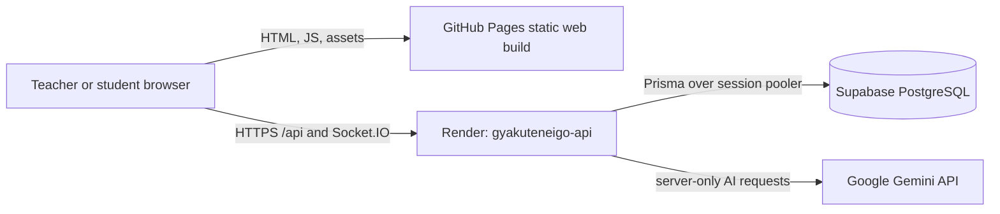

# GyakutenEigo system source of truth

This is the canonical current-state description of GyakutenEigo and its
QuizStrike classroom game. Use this file when architecture notes, handoff
notes, and feature documents disagree. `architecture.md` is the compact
authority map, `HANDOFF.md` is the operational checklist, and
`docs/online-play.md` is the hosting runbook; all three should point back here
for facts about the live system.

**Last verified:** 1 September 2026 (JST)
**Application baseline:** `76840ec` (`Add Gemini Speaking providers`)
**Repository:** <https://github.com/susume/GyakutenEigo>

## 1. Current production state

| Area | Current state |
| --- | --- |
| Web app | React/Vite static build from `apps/web`, deployed by GitHub Pages |
| Website | `https://gyakuteneigo.com` and `https://www.gyakuteneigo.com` |
| API/realtime | Render service `gyakuteneigo-api`, exposed at `https://api.gyakuteneigo.com` and `https://gyakuteneigo-api.onrender.com` |
| Database | Supabase PostgreSQL, project `Quiz Strike Production`, Sydney region (`ap-southeast-2`) |
| ORM/migrations | Prisma schema and committed migrations in `prisma/` |
| Speaking AI | Server-side Gemini for conversation, help, evaluation, and audio transcription |
| Runtime store | One process-local authoritative room runtime; `RUNTIME_STORE=in-memory` is the only supported value |
| Deployment branch | `main` |

The API health endpoint is currently healthy at both API origins and reports
`storage: postgres`. The Render process runs `prisma migrate deploy` before it
starts listening. The website is static GitHub Pages: its `/api/health` path
currently returns 404 because the checked-in Cloudflare Worker is not yet the
live website edge. The web build therefore keeps the explicit Render API
origin enabled through `VITE_API_URL` and `VITE_ALLOW_PRODUCTION_API_OVERRIDE`.

The `api.gyakuteneigo.com` DNS record points directly to the Render service.
That custom API hostname is live; it must not be described as proof that the
separate Cloudflare Worker is deployed. The Worker source is a prepared,
selective proxy for a future same-origin cutover.

The former Render PostgreSQL database was retired after the 1 August 2026
Supabase migration. The final local native backup is retained outside Git at
`database-backups/quizstrike-render-20260801-231819.dump`.

## 2. System boundary and request paths

### Live path



The browser obtains the API and Socket.IO base URL from the build-time web
configuration. The current Pages workflow defaults to
`https://gyakuteneigo-api.onrender.com`. The API custom domain is also valid
for diagnostics and compatible browser builds.

### Prepared but not live

```mermaid
flowchart LR
  Site[gyakuteneigo.com / www.gyakuteneigo.com]
  Worker[Cloudflare Worker routes]
  API[Render API]

  Site -. /api/* and /socket.io/*, after DNS cutover .-> Worker
  Worker -. selective proxy .-> API
```

Do not set `VITE_ALLOW_PRODUCTION_API_OVERRIDE=false` until both website
hostnames return the API health JSON and a real Socket.IO polling/upgrade check
passes through the Worker. Until then, changing the web build to assume
same-origin API traffic will reproduce the 404 failure.

## 3. Repository map

| Path | Ownership and responsibility |
| --- | --- |
| `apps/web` | React 19/Vite client, History API routing, teacher and student experiences, Three.js arena, speaking UI |
| `apps/server` | Express 5 HTTP API, Socket.IO transport, authentication, authoritative room engine, bots, speaking orchestration, persistence scheduling |
| `packages/shared` | Shared TypeScript contracts, Zod protocol schemas, game rules, session settings, Athletics rules, speaking types |
| `prisma/schema.prisma` | PostgreSQL model contract |
| `prisma/migrations` | Ordered production database migrations |
| `infrastructure/cloudflare` | Prepared selective `/api/*` and `/socket.io/*` Worker proxy; not the current website path |
| `.github/workflows/ci.yml` | Node 22 typecheck, test, and build verification |
| `.github/workflows/deploy-web.yml` | GitHub Pages build/deploy, SPA fallback, CNAME, public web build variables |
| `scripts/database` | Backup, audit, migration, and runtime-snapshot tools |
| `docs` | Focused feature, migration, performance, and QA records; historical notes retain their original dates |

The server composition root is `apps/server/src/runtime.ts`. The browser
composition and route boundary are `apps/web/src/BrowserApp.tsx`,
`apps/web/src/navigation.ts`, and `apps/web/src/features/quizstrike/QuizStrikeApp.tsx`.

## 4. Browser product surface

| Route | Purpose |
| --- | --- |
| `/` | Public GyakutenEigo home page |
| `/quiz-strike` | QuizStrike landing, teacher authentication entry, and competition entry |
| `/quiz-strike/teacher/*` | Canonical authenticated teacher workspace |
| `/speak/teacher/*` | Compatibility alias; normalizes to `/quiz-strike/teacher/speaking/*` |
| `/join?code=ROOM` | Student QuizStrike join screen |
| `/game` | Student live arena after joining a QuizStrike room |
| `/speak` | Public Speaking Practice entry |
| `/speak/join/:activityCode` | Speaking student join flow |
| `/speak/session/:sessionId` | Speaking student session flow |
| `/speak/result/:participantId` | Speaking student result flow |
| `/quiz-strike/organizer` | Organizer competition workspace |
| `/quiz-strike/competitions/:slug` | Public competition view |
| `/quiz-strike/tournaments/:id/register` | Tournament registration |
| `/tournament-study/:id` | Released tournament study page |
| `/check` and `/diagnostics` | Network/API/realtime diagnostics |
| `/character-lab` | Development-only rendering and performance harness |

The teacher shell currently contains Home, Discover, Library, Reports,
Speaking Practice, Competitions, and Settings. QuizStrike room setup is a
three-part flow: game mode, arena/rules, and advanced settings. The web app
uses a small History API router; React Router is not installed. GitHub Pages
creates `404.html` and direct route entry points during deployment.

### QuizStrike modes

The shared contract currently defines four top-level `GameMode` values:

- `classic`: team tag/arena rounds;
- `flag`: Red carries and plants an objective while Blue defends/captures;
- `zombie`: human/zombie roles, conversion, energy, and zombie combat;
- `athletics`: a server-authoritative parkour race on the Athletics course.

Athletics has four shared variants: Classic Athletics, Zeus Mode, Hunters &
Runners, and Chaos Climb. They use the same answer history and server-owned
course progress while adding variant-specific roles, energy, abilities,
hazards, or Zeus attacks. Standard arena maps remain Desert Citadel, Iron
Junction, and Temple Runoff; Athletics uses the authored Stadium Loop course
and the `athletics_park` session map identifier.

## 5. Server responsibilities

`runtime.ts` wires these authority boundaries:

| Area | Primary code owner |
| --- | --- |
| Authentication and teacher identity | `routes/authRoutes.ts` |
| Teacher dashboard, classes, folders, library | `routes/teacherLibrary.ts`, `routes/studySets.ts`, `teacherLibrary.ts` |
| Quiz/question CRUD and question audio | `routes/quizSets.ts`, `routes/questions.ts` |
| Room creation, start/end/pause, history | `routes/sessionRoutes.ts` |
| Student join, rejoin, answer, shop | `routes/playerRoutes.ts` |
| Live room binding and snapshots | `realtime/protocolGateway.ts`, `realtime/roomAuthority.ts`, `connectionLifecycle.ts` |
| Round lifecycle and deadlines | `roundRuntime.ts`, `roundFlow.ts` |
| Combat, flag, bots, and bot navigation | `combat.ts`, `botRuntime.ts`, `botAI.ts`, `botNavigation.ts` |
| Athletics race and variants | `athleticsAuthority.ts`, `athleticsModeAuthority.ts`, `athletics*` shared rules |
| Reports and Learning Pulse | `routes/reports.ts`, `studentLearningReport.ts`, runtime report helpers |
| Speaking Practice | `routes/speakingRoutes.ts`, `speakingProviders.ts`, `speakingRepository.ts` |
| Competitions and Tournament Center | `competitionDomain.ts`, `routes/competitionRoutes.ts`, `tournamentDomain.ts`, `routes/tournamentRoutes.ts` |
| Persistence and normalized library | `persistence/normalizedLibrary.ts`, `persistence/persistenceScheduler.ts` |

The browser sends intent. The server decides correctness, damage, money,
eliminations, objectives, round results, bot behavior, and authoritative
positions. Student payloads never contain question correctness or teacher-only
Learning Pulse data.

## 6. Persistence and state ownership

### Durable PostgreSQL data

Prisma persists users, classes, quiz/study sets, folders, questions and
question audio, game sessions, players, answer logs, round logs, reports,
contribution/recognition data, competition/tournament data, and Speaking
activities, sessions, participants, turns, and evaluations.

`apps/server/src/persistence/normalizedLibrary.ts` is the durable source for
teacher library and report reads/writes when a database is configured.
`QuestionAudio.data` is bounded and served only through authenticated,
server-controlled routes.

### Process-local live state

With `RUNTIME_STORE=in-memory`, the single Render process owns:

- live room objects and join-code directory;
- room leases/fencing, sockets, timers, bot memory, and disconnect grace;
- rate limits, request deduplication, transient player/decal bytes, and
  Athletics projectile/hazard runtime state.

`RuntimeSnapshot` with id `primary` is a recoverable active-session
checkpoint and a legacy/backfill source. It is not the authority for new
teacher-library writes, and Learning Pulse is recomputed from authoritative
answer logs rather than embedded in the checkpoint.

There is no distributed room store or Socket.IO adapter in this build. Do not
add Render replicas or change `RUNTIME_STORE` to `redis` without implementing
distributed ownership, fan-out, reconnect routing, deduplication/rate limits,
and object-backed decal storage.

## 7. HTTP and Socket.IO contract

The Express API is grouped under `/api` and includes:

- `/api/auth/*`, `/api/me`, and `/api/health`;
- teacher/library paths under `/api/teacher`, `/api/classes`, `/api/folders`,
  `/api/study-sets`, `/api/quiz-sets`, `/api/questions`, and `/api/reports`;
- live room paths under `/api/sessions`, `/api/question-audio`, and player/
  appearance/decal subpaths;
- `/api/speaking/*` for activity, session, turn, help, and result flows;
- `/api/competitions/*`, `/api/competition-*`, `/api/tournaments/*`, and
  `/api/tournament-study/*` for organizer and competition features.

The current shared protocol is version 1. A temporary server adapter accepts
unversioned legacy version-0 clients during rollout; version 0 is not a
canonical client contract. The normal connection sequence is:

1. Socket.IO connects.
2. The browser sends `client_hello` with protocol version 1.
3. The server returns `server_hello` with the connection id and clock.
4. The browser sends `join_session_room` with either the teacher JWT or scoped
   player token.
5. The server binds the socket to a role-scoped room and emits a sanitized
   `session_state` snapshot.

All commands are schema-validated and size/range checked before reaching game
logic. Reconnect repeats the handshake and receives a complete authoritative
snapshot. See `packages/shared/PROTOCOL.md` for the wire-level contract.

## 8. Speaking Practice

Production requires both provider selectors unless explicit mock mode is
enabled. Render currently uses:

```text
SPEAKING_MOCK_MODE=false
SPEAKING_AI_PROVIDER=gemini
SPEAKING_TRANSCRIPTION_PROVIDER=gemini
SPEAKING_GEMINI_API_KEY=<server-only secret>
SPEAKING_GEMINI_MODEL=gemini-2.5-flash-lite
SPEAKING_GEMINI_TRANSCRIPTION_MODEL=gemini-2.5-flash-lite
```

The API sends audio and prompts from the server to Gemini. The browser never
receives the key. Speaking turns persist transcript text, timing, and
evaluation data; raw audio is not stored in the Speaking models. OpenAI is a
supported alternative through the corresponding provider selectors and
server-only key. Mock mode is for local/tests or an explicit, intentional
override; it is not an acceptable accidental production fallback.

## 9. Deployment and configuration contract

### Render API

Build command used by the service:

```text
npm ci --include=dev && npm run build -w @quizstrike/shared && npm run build -w @quizstrike/server
```

Start command:

```text
npm start -w @quizstrike/server
```

Required/active server configuration names:

```text
NODE_ENV=production
NODE_VERSION=22
PORT=<Render-provided port or local 4000>
JWT_SECRET=<server-only secret>
DATABASE_URL=<Supabase session-pooler URL>
CLIENT_ORIGIN=https://gyakuteneigo.com,https://www.gyakuteneigo.com,https://susume.github.io
TRUST_PROXY=true
RUNTIME_STORE=in-memory
SPEAKING_MOCK_MODE=false
SPEAKING_AI_PROVIDER=gemini
SPEAKING_TRANSCRIPTION_PROVIDER=gemini
SPEAKING_GEMINI_API_KEY=<server-only secret>
SPEAKING_GEMINI_MODEL=gemini-2.5-flash-lite
SPEAKING_GEMINI_TRANSCRIPTION_MODEL=gemini-2.5-flash-lite
```

`PORT` is provider-controlled on Render; the local default is 4000. Never put
`DATABASE_URL`, `JWT_SECRET`, provider keys, Supabase credentials, tokens, or
private decal bytes in `VITE_*` variables or Git.

### GitHub Pages web build

The `Deploy Web` workflow runs on `main` pushes or manual dispatch, builds
`@quizstrike/shared` and `@quizstrike/web` on Node 22, and publishes
`apps/web/dist`. It currently defaults to:

```text
VITE_BASE_PATH=/
PAGE_CUSTOM_DOMAIN=www.gyakuteneigo.com
VITE_API_URL=https://gyakuteneigo-api.onrender.com
VITE_ALLOW_PRODUCTION_API_OVERRIDE=true
```

The workflow creates `404.html` and route entry points for the supported SPA
paths. If the Pages repository variables differ from these defaults, verify
the deployed artifact and update this document.

### Database release rules

Use `npx prisma validate` locally and `prisma migrate deploy` through the
controlled server startup path. Do not use `prisma db push` or
`prisma migrate dev` against Supabase production. A successful release must
show migrations complete before the server announces readiness.

## 10. Security and classroom invariants

- Keep all game outcomes and answer correctness server-authoritative.
- Never include `correctChoice` or explanation in a public student question.
- Authenticate teacher ownership for every private teacher operation.
- Use scoped player tokens for student join/rejoin and result access.
- Keep Learning Pulse teacher-only and derived from non-bot authoritative logs.
- Bound, authenticate, expire, and keep custom decal bytes out of snapshots.
- Keep teacher pause separate from round-result status and shift deadlines only
  through owner-authorized pause/resume actions.
- Keep the product school-safe: snow tags, snowball launchers, warmth, gear,
  arena, Blue Team, and Red Team. No gore, realistic weapon branding, public
  matchmaking, public chat, voice chat, or copied Counter-Strike content.

## 11. Known gaps and explicit next work

1. **Cloudflare same-origin cutover is prepared, not live.** The Worker and
   tests exist, but DNS and live website-path verification are still required.
2. **Runtime is single-instance.** A process restart drops active sockets and
   live in-memory state apart from the recoverable checkpoint.
3. **Physical classroom certification remains separate work.** Automated
   browser, load, WebGL, and build checks do not replace a real school iPad or
   Chromebook network/GPU run.
4. **No repository license is declared.** Do not add a license or imply reuse
   permissions without an explicit owner decision.
5. **Historical documents are not operational truth.** Their dates and
   measured results are useful records, but current deployment facts belong in
   this file.

## 12. Verification record

Verified against the repository and public endpoints on 1 September 2026:

- The application state was clean at `76840ec` before this documentation
  update; the documentation commit may be newer.
- GitHub Actions `CI` and `Deploy Web` succeeded for `76840ec`.
- `https://api.gyakuteneigo.com/api/health` returned HTTP 200 with
  `ok: true` and `storage: postgres`.
- `https://gyakuteneigo-api.onrender.com/api/health` returned the same.
- `https://gyakuteneigo.com/` and `https://www.gyakuteneigo.com/` returned the
  static Pages app; their `/api/health` paths returned 404.
- Apex DNS resolves to GitHub Pages addresses, `www` CNAMEs to
  `susume.github.io`, and `api` CNAMEs to `gyakuteneigo-api.onrender.com`.
- DNS nameservers remain `dns1.registrar-servers.com` and
  `dns2.registrar-servers.com`; the domain is not delegated to Cloudflare.

Run the full local checks before changing a contract or release:

```powershell
npm run lint
npm run typecheck
npm test
npm run build
npm run test:load
npm run test:e2e
npm run test:proxy
npx prisma validate
```
