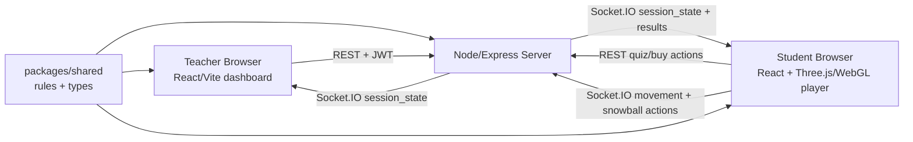

# QuizStrike Architecture

QuizStrike Classroom is a multiplayer quiz arena. Teachers create quiz sets and sessions in the web app. Students join with a session code, answer questions to earn quiz money, and play a snowball-tag arena through the React + Three.js/WebGL browser client.

## System Overview



## Repository Layout

- `apps/web`: React + Vite app for teacher dashboard, student join flow, and the Three.js/WebGL arena player.
- `apps/server`: Express + Socket.IO backend for teacher auth, quiz sets, sessions, quiz answers, snowball purchases, bots, movement, and snowball tag results.
- `packages/shared`: TypeScript contracts and deterministic game rules shared by web and server.
- `docs`: deployment and handoff notes.
- `prisma`: reserved database schema area. The current backend still uses in-memory maps.

## Runtime Components

### Web App

Entry points:

- `apps/web/src/main.tsx`
- `apps/web/src/App.tsx`
- `apps/web/src/api/client.ts`
- `apps/web/src/game/ArenaPreview.tsx`
- `apps/web/src/game/desertCitadelMap.ts`

Responsibilities:

- Teacher signup/login and dashboard.
- Class and quiz-set creation.
- Session creation and classroom settings.
- Live teacher roster and reports.
- Student join form at `/join`.
- Three.js/WebGL FPS arena at `/game`, including live Socket.IO movement, snowball actions, corridor-friendly map collision, and minimap exploration support.

Configuration:

- `VITE_API_URL` sets the public server URL for hosted builds.
- If `VITE_API_URL` is not set, local browser builds use `http://<host>:4000`.

### Server

Entry point:

- `apps/server/src/index.ts`

Responsibilities:

- Teacher JWT auth.
- In-memory teacher, class, quiz, session, answer, player-token storage.
- Public student session join by code.
- Quiz question issuing and answer validation.
- Money, score, snowball, gear, and damage resolution using shared rules.
- Socket.IO rooms per session code for live roster, movement, and snowball actions.
- Bot creation and simple bot movement.
- CSV report export.

Important routes:

- `GET /health`
- `POST /api/auth/signup`
- `POST /api/auth/login`
- `GET /api/teacher/dashboard`
- `POST /api/quiz-sets`
- `POST /api/quiz-sets/:id/questions`
- `POST /api/sessions`
- `POST /api/sessions/:code/start`
- `POST /api/sessions/:code/bots`
- `POST /api/sessions/:code/join`
- `GET /api/sessions/:code/players/:playerId/question`
- `POST /api/sessions/:code/players/:playerId/answer`
- `POST /api/sessions/:code/players/:playerId/buy`
- `POST /api/sessions/:code/players/:playerId/buy-snowballs`

Socket events:

- `join_session_room`
- `session_state`
- `player_position`
- `fire_action`
- `damage_result`
- `elimination_update`
- `quiz_result`
- `error_message`

Production config:

- `NODE_ENV=production`
- `JWT_SECRET` must be set to a real secret.
- `CLIENT_ORIGIN` should be the hosted web app URL.
- `TRUST_PROXY=true` when hosted behind a proxy.

### Shared Rules Package

Entry point:

- `packages/shared/src/index.ts`

Responsibilities:

- Core data contracts: `TeacherUser`, `QuizSet`, `Question`, `GameSession`, `PlayerSession`, `SessionSettings`.
- Session setting defaults and sanitization.
- Quiz reward resolution.
- Player-token validation.
- Question gate to prevent stale or repeated answer submissions.
- Gear definitions.
- Arena spawn, bounds, base-zone checks, and objective metadata.
- Snowball use and snowball purchase rules.
- Snowball tag damage/elimination resolution.
- Report CSV generation.

Rule tests live in:

- `packages/shared/src/sessionRules.test.ts`
- `packages/shared/src/studentSecurity.test.ts`

## Main User Flows

### Teacher Session Flow

1. Teacher signs up or logs in.
2. Teacher creates a quiz set and adds multiple-choice questions.
3. Teacher creates a session with settings such as starting money, snowball pack price, snowballs per pack, and max players.
4. Teacher shares the generated session code.
5. Teacher can add bots for testing.
6. Teacher starts the round.
7. Teacher watches live roster and ends session to view report/CSV.

### Student Arena Flow

1. Student opens `/join`.
2. Student enters session code and nickname.
3. React calls `POST /api/sessions/:code/join`.
4. React opens `/game` with the joined player context.
5. The Three.js arena joins the Socket.IO room and renders the Desert Citadel map.
6. Student answers questions to earn money.
7. Student buys snowballs or gear.
8. Student explores the arena with the minimap, launches snowballs, and receives server-authoritative results.

## Data Model Summary

The current in-memory server stores:

- `users`: teacher accounts with password hashes.
- `classes`: teacher-owned class summaries.
- `quizSets`: teacher-owned quiz sets and questions.
- `sessions`: live game sessions with players.
- `answers`: answer logs used for reports.
- `playerTokens`: per-student session tokens.
- `playerQuestionGate`: current issued question per player.
- `quizRateLimits`: simple answer-submission throttling.

Important limitation:

- This data disappears when the server restarts.
- A real classroom deployment should move these collections into persistent database tables.

## Online Deployment Shape

For hosted playtests:

1. Deploy `apps/server` as one Node service.
2. Deploy `apps/web/dist` as a static site.
3. Set `VITE_API_URL` in the web build to the public server URL.
4. Set `CLIENT_ORIGIN` on the server to the public web URL.

See `docs/online-play.md` for deployment commands and checklist.

## Verification Commands

```bash
npm ci
npm run typecheck
npm test
npm run build
```

Current known build note:

- Vite warns that the web bundle is larger than 500 kB. This is expected for now because the app includes Three.js and game-facing code. It is not a failing build error.

## Design And Safety Constraints

- Use school-safe language: snowballs, snowball launcher, warmth, gear, arena.
- Do not use Counter-Strike names, maps, sounds, realistic weapon terminology, blood, gore, public matchmaking, public chat, or voice chat.
- Students do not need accounts or emails; they join with code and nickname.
- Teachers own quiz data and session reports.
- Server-side validation is the authority for quiz rewards, money, snowballs, gear, damage, and eliminations.

## Current Risks And Next Architecture Milestones

- Persistence: replace in-memory maps with database-backed repositories.
- Horizontal scaling: Socket.IO rooms and session state currently assume one server instance.
- Security hardening: add stricter production rate limits, persistent token revocation, request logging, and hosted HTTPS-only checks.
- Accessibility: improve keyboard, screen-reader, and reduced-motion flows, especially around the game UI.
- Observability: add structured logs and server metrics for online playtests.
