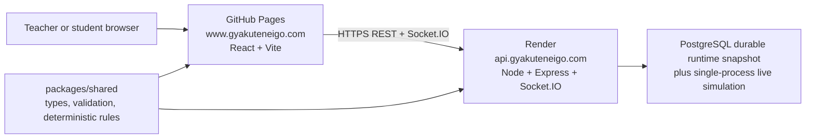

# GyakutenEigo and Quiz Strike Architecture

GyakutenEigo is the public English-learning site. Quiz Strike is its separate, private classroom multiplayer game. The landing page lives at `/`; the Quiz Strike host page lives at `/quiz-strike`.

## Production Topology



### Public addresses

| Purpose | Address | Host |
| --- | --- | --- |
| GyakutenEigo landing page | `https://www.gyakuteneigo.com/` | GitHub Pages |
| Quiz Strike host page | `https://www.gyakuteneigo.com/quiz-strike/` | GitHub Pages |
| Student join page | `https://www.gyakuteneigo.com/join/` | GitHub Pages |
| Student arena | `https://www.gyakuteneigo.com/game/` | GitHub Pages |
| Game API and Socket.IO server | `https://api.gyakuteneigo.com/` | Render |
| Service health check | `https://api.gyakuteneigo.com/api/health` | Render |

The apex address, `https://gyakuteneigo.com`, is also a valid entry point and must remain allowed by the API. It may redirect visitors to `www`, but requests can originate from either address during that transition.

## Repository Layout

- `apps/web`: React + Vite site. It contains the GyakutenEigo landing page, Quiz Strike marketing/host page, teacher dashboard, student join flow, and Three.js/WebGL arena.
- `apps/server`: Express + Socket.IO API for teacher authentication, quiz data, sessions, game simulation, bots, live state, reports, and CSV exports.
- `packages/shared`: shared TypeScript contracts, input validation, map data, session rules, quiz economy, movement checks, game-mode rules, and report helpers.
- `docs`: deployment instructions and the developer handoff prompt.
- `.github/workflows/deploy-web.yml`: GitHub Pages build and deployment workflow.
- `prisma`: reserved for a future persistent database. It is not active in the deployed game.

## Web Application

Primary client entry points:

- `apps/web/src/App.tsx`: client routes and teacher/student flows.
- `apps/web/src/api/client.ts`: API base URL selection, HTTP calls, and teacher/player credentials.
- `apps/web/src/game/ArenaPreview.tsx`: Three.js renderer, FPS controls, arena UI, mobile controls, and client Socket.IO events.
- `apps/web/src/game/desertCitadelMap.ts`: Desert Citadel geometry, routes, landmarks, and collision layout.

Routes are implemented by the React application and are also emitted as static fallback folders during the Pages build:

- `/`: GyakutenEigo home.
- `/quiz-strike`: Quiz Strike landing page and teacher entry.
- `/join`: student session-code and nickname flow.
- `/game`: student arena.
- `/character-lab`: character preview.

The build reads `VITE_API_URL`. In production it is `https://api.gyakuteneigo.com`; on local development hosts it defaults to port `4000` on the same machine.

## Server Application

Entry point: `apps/server/src/index.ts`.

The server is the authority for authentication, teacher-owned data, valid player tokens, question issue/answer gates, quiz rewards, purchases, movement constraints, snowball use, hit resolution, eliminations, respawns, mode objectives, bot behavior, and reports. The browser is a renderer and input source; it is not trusted for money, answers, ammo, targets, or final player state.

Important HTTP routes:

- `GET /health` and `GET /api/health`: deployment health checks.
- `POST /api/auth/signup`, `POST /api/auth/login`, `GET /api/me`: teacher authentication.
- `GET /api/teacher/dashboard`: teacher workspace data.
- `POST /api/classes`, `POST /api/quiz-sets`, `POST /api/quiz-sets/:id/questions`: teacher content creation.
- `POST /api/sessions`, `POST /api/sessions/:code/start`, `POST /api/sessions/:code/end`: session lifecycle.
- `POST /api/sessions/:code/bots`: test bot creation.
- `POST /api/sessions/:code/join`: public student entry by session code and nickname.
- `GET /api/sessions/:code/players/:playerId/question` and `POST /api/sessions/:code/players/:playerId/answer`: quiz play.
- `POST /api/sessions/:code/players/:playerId/buy` and `POST /api/sessions/:code/players/:playerId/buy-snowballs`: purchases.
- `GET /api/sessions/:code/report` and `/report.csv`: teacher session results.

Socket.IO room events:

- Client to server: `join_session_room`, `player_position`, `fire_action`, `flag_action`.
- Server to clients: `session_state`, `game_event`, `damage_result`, `elimination_update`, `error_message`.

## Game Rules and Modes

Shared game contracts and deterministic helpers are in `packages/shared/src/index.ts`; focused tests are in `packages/shared/src/sessionRules.test.ts` and `packages/shared/src/studentSecurity.test.ts`.

### Flag Mode (default)

- Red Team carries the flag from Red base to Blue base.
- Red protects a placed flag; Blue captures it.
- Round count, round duration, flag-hold duration, teams, quiz economy, snowball supplies, and player limits are teacher settings.

### Zombie Mode

- Selected players begin as zombies.
- Zombies convert humans through valid server-side tag actions.
- The match ends when every human has been converted.

### Classroom game loop

1. A teacher creates a quiz set and a private session.
2. Students join with the generated code and a classroom-safe nickname; they do not create accounts.
3. The teacher starts the session and may add bots while testing.
4. Students answer questions for in-game money, buy gear or snowball packs, and play in the Desert Citadel arena.
5. Eliminated players can complete practice questions to respawn when the session settings permit it.
6. The teacher ends the session and reviews live results or exports CSV.

The map is a lightweight, original Desert Citadel blockout with team spawns, free-for-all spawn metadata, protected buy zones, capture/delivery areas, obstacle bounds, a minimap, and classroom-safe visuals.

## Deployment Configuration

### GitHub Pages

The Pages workflow builds the shared package first, then the web application. It supplies:

```text
VITE_API_URL=https://api.gyakuteneigo.com
VITE_BASE_PATH=/
PAGE_CUSTOM_DOMAIN=www.gyakuteneigo.com
```

It writes `CNAME`, creates SPA fallback pages for `/quiz-strike`, `/join`, `/game`, and `/character-lab`, then deploys `apps/web/dist`.

DNS for the site uses GitHub Pages records at the apex and a `www` CNAME to `susume.github.io`. GitHub Pages provides HTTPS for the site.

### Render API service

The active service is `gyakuteneigo-api` and its custom domain is `api.gyakuteneigo.com`.

Render build command:

```text
npm ci --include=dev && npx prisma generate && npm run build -w @quizstrike/shared && npm run build -w @quizstrike/server
```

Render start command:

```text
npm start -w @quizstrike/server
```

Required Render environment variables:

```text
NODE_ENV=production
NODE_VERSION=22
JWT_SECRET=<long random secret>
TRUST_PROXY=true
CLIENT_ORIGIN=http://www.gyakuteneigo.com,https://www.gyakuteneigo.com,http://gyakuteneigo.com,https://gyakuteneigo.com
```

`CLIENT_ORIGIN` is a comma-separated allow-list used by both Express CORS and Socket.IO. Omitting either HTTPS origin blocks teacher account creation or real-time game connections when visitors use that address. Do not expose or commit the actual `JWT_SECRET`.

The `api` DNS record is a CNAME to `gyakuteneigo-api.onrender.com`. Render must show the custom domain as verified with a certificate issued before relying on `https://api.gyakuteneigo.com`.

## Data and Operational Limits

The live simulation keeps transient rate limits, fire cooldowns, socket bindings, and question gates in process memory. Durable classroom state (teachers, classes, quizzes, sessions, players, and answer logs) is mirrored to PostgreSQL through the `RuntimeSnapshot` record and restored at startup. Production refuses to start without `DATABASE_URL`; local development may intentionally use temporary memory-only data. The free Render tier can still take time to wake after inactivity; the first request may be slow.

The server assumes one process. Socket.IO rooms and in-memory state are not shared between multiple instances. Before a serious classroom launch, add persistent storage and a shared Socket.IO adapter or keep a single instance intentionally.

## Verification

Run before pushing code:

```bash
npm run typecheck
npm test
npm run build
```

For a live deployment check:

1. Open `https://api.gyakuteneigo.com/api/health` and confirm a successful response.
2. Open `https://www.gyakuteneigo.com/quiz-strike/` and create a teacher account.
3. Create a quiz/session, open `https://www.gyakuteneigo.com/join/` in a second browser, join with the code, then start the round.
4. Verify that the teacher roster and student arena update live.

The Vite bundle-size warning is expected because the frontend includes Three.js and game code; it is not a build failure.

## Next Architecture Milestones

1. Replace in-memory maps with persistent database repositories and migrations.
2. Add import/export or seed flows for teacher quiz content.
3. Add production request logging, monitoring, durable rate limits, and token revocation.
4. Add browser-based end-to-end tests for signup, teacher session creation, student join, gameplay, and reports.
5. Improve keyboard, screen-reader, reduced-motion, and mobile accessibility across the teacher and game interfaces.
