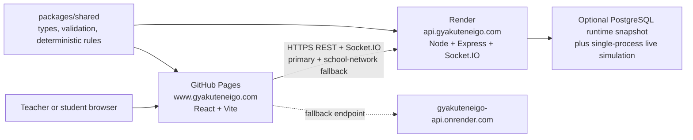

# GyakutenEigo and Quiz Strike Architecture

GyakutenEigo is the public English-learning site. Quiz Strike is its separate, private classroom multiplayer game. The landing page lives at `/`; the Quiz Strike host page lives at `/quiz-strike`.

## Production Topology



### Public addresses

| Purpose | Address | Host |
| --- | --- | --- |
| GyakutenEigo landing page | `https://www.gyakuteneigo.com/` | GitHub Pages |
| Quiz Strike host page | `https://www.gyakuteneigo.com/quiz-strike/` | GitHub Pages |
| Student join page | `https://www.gyakuteneigo.com/join/` | GitHub Pages |
| Student arena | `https://www.gyakuteneigo.com/game/` | GitHub Pages |
| Game API and Socket.IO server | `https://api.gyakuteneigo.com/` | Render |
| API fallback for restricted networks | `https://gyakuteneigo-api.onrender.com/` | Render |
| Service health check | `https://api.gyakuteneigo.com/api/health` | Render |

The apex address, `https://gyakuteneigo.com`, is also a valid entry point and must remain allowed by the API. The GitHub Pages origin `https://susume.github.io` is also supported for alternate/default Pages URLs. The browser tries `api.gyakuteneigo.com` first and automatically falls back to `gyakuteneigo-api.onrender.com` after a network failure; the successful endpoint is reused for Socket.IO.

## Repository Layout

- `apps/web`: React + Vite site. It contains the GyakutenEigo landing page, Quiz Strike marketing/host page, teacher dashboard, student join flow, and Three.js/WebGL arena.
- `apps/web/src/api/endpoints.ts`: endpoint normalization and network-fallback request helper.
- `apps/server`: Express + Socket.IO API for teacher authentication, quiz data, sessions, game simulation, bots, live state, reports, and CSV exports.
- `apps/server/src/origins.ts`: production CORS origin normalization and supported hosted-origin defaults.
- `packages/shared`: shared TypeScript contracts, input validation, map data, session rules, quiz economy, movement checks, game-mode rules, and report helpers.
- `docs`: deployment instructions and the developer handoff prompt.
- `.github/workflows/deploy-web.yml`: GitHub Pages build and deployment workflow.
- `prisma`: optional persistence schema and migrations. It is not active in the current deployed Render service because `DATABASE_URL` is not configured.

## Audit and Current Implementation Status

The bounded live multiplayer audit was completed locally on 2026-07-12/13 with independent teacher and student browser stores plus a server bot. Flag Mode, Zombie Mode, and Classic Tag Practice were exercised through room creation, join, start, timeout/results, quiz rewards, and selected combat/shop flows. Evidence and the detailed before/after findings are in `docs/live-multiplayer-qa/`.

The audit findings and subsequent classroom fixes are implemented on `main` and deployed:

- Mode-aware Zombie results, Human/Zombie lobby and scoreboard terminology, clean result overlays, ended-state `0:00`, and precise inactive-round messages.
- Cause-specific student join recovery copy for invalid codes, duplicate nicknames, full rooms, active/ended rooms, and connection failures.
- New identities are rejected after a round starts with `409 This session has already started.`; authenticated existing-player rejoin remains allowed.
- Student Socket.IO room joins authenticate the player token. Last-socket disconnects mark a player Offline, drop a carried Flag, broadcast an event, and reevaluate Flag/Zombie resolution after a five-second reconnect grace period. Disconnected players are excluded from active counts and authoritative targeting.
- The Starter launcher is hidden from the Buy Menu and cannot be used as a server-side downgrade. Quick costs `$3000`; Heavy/AWP costs `$6000`; launcher ranges are Starter `36`, Quick `48`, and Heavy `120`.
- Teachers can copy `/join?code=<SESSION_CODE>` links. The student page reads the code from the URL and asks only for a nickname.
- Desert Citadel house blocks and roofs use a raised roofline (`+2.25` map units before arena scaling).
- Projector waiting room with QR code, large join code, roster, copy-link action, keyboard focus trapping, and mobile layout.
- Server-stamped session time keeps teacher/student countdowns synchronized; the round timer is clamped to its configured duration.
- Classic Tag Practice now advances through configured rounds over the existing Socket.IO connection. A timed round selects the winner from team score, then tags, while ties remain draws.
- Flag and Classic Tag rounds now enter a four-second server-controlled result intermission. Every client receives the same winner announcement before the server starts and announces the next round; the final Classic Tag result names the winner and displays Game Over.
- Zombie conversions record their server timestamp. At Game Over, the announcement names up to six best survivors: remaining Humans first, followed by the last Humans converted into Zombies.
- Bots pursue the nearest active real opponent and detour around arena cover instead of freezing against a blocked path.
- Hosted account creation and Socket.IO connections retry the Render service hostname when a school network blocks the branded `api.` hostname.

Validation for this implementation is green: 53 shared tests, 4 server tests, 41 web tests, server/web typechecks, full production build, live 60-second Classic Tag round transition, live bot socket movement, GitHub Actions CI, and Render deployment.

### Remaining live QA gaps

The audit is not release certification. Still unverified or only partially covered are complete Flag placement/capture/hold and simultaneous objective races; Zombie projectile conversion and near-simultaneous conversions; knocked-out refresh/rejoin; host-browser disconnect; multi-tab/network-drop edge cases; hold/release Tab scoreboard behavior; human-vs-human damage and full weapon/zoom/reload coverage; 40-player scale; long soak; real Chromebook performance; FPS/heap/GPU/long-task/HAR/WebSocket instrumentation; and safe live client-message mutation/replay. The deployed Render service is also memory-only until `DATABASE_URL` is configured.

## Web Application

Primary client entry points:

- `apps/web/src/App.tsx`: client routes and teacher/student flows.
- `apps/web/src/api/client.ts`: API endpoint selection with Render fallback, HTTP calls, and teacher/player credentials.
- `apps/web/src/api/endpoints.ts`: normalized endpoint candidates and retry-on-network-failure behavior.
- `apps/web/src/game/ArenaPreview.tsx`: Three.js renderer, FPS controls, arena UI, mobile controls, and client Socket.IO events.
- `apps/web/src/game/mapTypes.ts`: shared client-side geometry types and map metadata shape.
- `apps/web/src/game/arenaMaps.ts`: map catalog and map lookup used by teacher setup and the renderer.
- `apps/web/src/game/desertCitadelMap.ts`: Desert Citadel geometry, raised house roofs, routes, landmarks, and collision layout.
- `apps/web/src/game/ironJunctionMap.ts`: The Iron Junction geometry, railway landmarks, routes, palette, and collision layout.
- `apps/web/src/navigation.ts`: route helpers plus student join-link code parsing and URL construction.

Routes are implemented by the React application and are also emitted as static fallback folders during the Pages build:

- `/`: GyakutenEigo home.
- `/quiz-strike`: Quiz Strike landing page and teacher entry.
- `/join`: student session-code and nickname flow; `/join?code=<SESSION_CODE>` pre-fills the code from a teacher link.
- `/game`: student arena.
- `/character-lab`: character preview.

The build reads `VITE_API_URL` and optional `VITE_API_FALLBACK_URL`. Production defaults are `https://api.gyakuteneigo.com` and `https://gyakuteneigo-api.onrender.com`; local development defaults to port `4000` on the same machine. HTTP fallback is only attempted when the current endpoint cannot be reached; normal HTTP error responses are not silently rerouted.

## Server Application

Entry point: `apps/server/src/index.ts`.

The server is the authority for authentication, teacher-owned data, valid player tokens, question issue/answer gates, quiz rewards, purchases, movement constraints, snowball use, hit resolution, eliminations, respawns, mode objectives, bot behavior, and reports. The browser is a renderer and input source; it is not trusted for money, answers, ammo, targets, or final player state.

Important HTTP routes:

- `GET /health` and `GET /api/health`: deployment health checks.
- `POST /api/auth/signup`, `POST /api/auth/login`, `GET /api/me`: teacher authentication.
- `GET /api/teacher/dashboard`: teacher workspace data.
- `POST /api/classes`, `POST /api/quiz-sets`, `POST /api/quiz-sets/:id/questions`: teacher content creation.
- `POST /api/sessions`, `POST /api/sessions/:code/start`, `POST /api/sessions/:code/end`: session lifecycle.
- `POST /api/sessions/:code/bots`: test bot creation.
- `POST /api/sessions/:code/join`: public student entry by session code and nickname.
- `GET /api/sessions/:code/players/:playerId/question` and `POST /api/sessions/:code/players/:playerId/answer`: quiz play.
- `POST /api/sessions/:code/players/:playerId/buy` and `POST /api/sessions/:code/players/:playerId/buy-snowballs`: purchases.
- `GET /api/sessions/:code/report` and `/report.csv`: teacher session results.

Socket.IO room events:

- Client to server: `join_session_room`, `player_position`, `fire_action`, `flag_action`.
- Server to clients: `session_state`, `game_event`, `damage_result`, `elimination_update`, `error_message`.

`join_session_room` accepts either a teacher room code or an authenticated student payload containing `code`, `playerId`, and `playerToken`. The server tracks sockets per player token, uses last-socket semantics for Offline state, and preserves a short reconnect grace period before mode win reevaluation.

## Game Rules and Modes

Shared game contracts and deterministic helpers are in `packages/shared/src/index.ts`; focused tests are in `packages/shared/src/sessionRules.test.ts` and `packages/shared/src/studentSecurity.test.ts`.

### Flag Mode (default)

- Red Team carries the flag from Red base to Blue base.
- Red protects a placed flag; Blue captures it.
- Round count, round duration, flag-hold duration, teams, quiz economy, snowball supplies, and player limits are teacher settings.

### Zombie Mode

- Selected players begin as zombies.
- Zombies convert humans through valid server-side tag actions.
- The match ends when every human has been converted.

### Classic Tag Practice

- Teams tag opposing players with server-validated snowball actions.
- The round timer advances the session to the next configured round instead of ending the whole session.
- The team with the higher score wins the round; tags break score ties, and equal totals produce a draw.

### Classroom game loop

1. A teacher creates a quiz set and a private session.
2. Students join with the generated code or a teacher-provided `/join?code=<SESSION_CODE>` link and a classroom-safe nickname; they do not create accounts.
3. The teacher starts the session and may add bots while testing.
4. Students answer questions for in-game money, buy gear or snowball packs, and play the teacher-selected arena.
5. Eliminated players can complete practice questions to respawn when the session settings permit it.
6. Multi-round Flag and Classic sessions broadcast the next active round to connected clients without requiring a refresh.
7. The teacher ends the session and reviews live results or exports CSV.

The map system supports a teacher-selected `SessionSettings.mapId`. Desert Citadel remains the default. The Iron Junction base is a cold industrial railway yard generated from the supplied design brief, with Maintenance Depot, Sorting Tracks and Gantry, Timber Line and Gorge, service-rotation markings, map-specific props, palette, minimap labels, spawns, collision proxies, bot movement obstacles, and projectile line-of-sight cover.

Weapon shop rules are shared between the client display and server authority. Starter is default equipment, Quick is `$3000`, Heavy/AWP is `$6000`, and the server resolves the increased launcher ranges from `packages/shared` rather than trusting the browser.

Map selection is authoritative at session creation. The web client sends `mapId`, the server sanitizes and broadcasts it with `GameSession`, and both students and teachers resolve the same map data. `packages/shared` owns map IDs, map-aware spawns, and simplified server collision proxies; `apps/web` owns the visual geometry and renderer details.

## Deployment Configuration

### GitHub Pages

The Pages workflow builds the shared package first, then the web application. It supplies:

```text
VITE_API_URL=https://api.gyakuteneigo.com
VITE_API_FALLBACK_URL=https://gyakuteneigo-api.onrender.com
VITE_BASE_PATH=/
PAGE_CUSTOM_DOMAIN=www.gyakuteneigo.com
```

It writes `CNAME`, creates SPA fallback pages for `/quiz-strike`, `/join`, `/game`, and `/character-lab`, then deploys `apps/web/dist`.

DNS for the site uses GitHub Pages records at the apex and a `www` CNAME to `susume.github.io`. GitHub Pages provides HTTPS for the site.

### Render API service

The active service is `gyakuteneigo-api` and its custom domain is `api.gyakuteneigo.com`.

Render build command:

```text
npm ci --include=dev && npm run build -w @quizstrike/shared && npm run build -w @quizstrike/server
```

Render start command:

```text
npm start -w @quizstrike/server
```

Required Render environment variables:

```text
NODE_ENV=production
NODE_VERSION=22
JWT_SECRET=<long random secret>
TRUST_PROXY=true
CLIENT_ORIGIN=https://gyakuteneigo.com,https://www.gyakuteneigo.com,https://susume.github.io
```

`CLIENT_ORIGIN` is a comma-separated allow-list used by both Express CORS and Socket.IO. Production also adds the three supported hosted origins by default. Omitting an additional school or Pages origin can block teacher account creation or real-time game connections when visitors use that address. Do not expose or commit the actual `JWT_SECRET`.

`apps/server/src/start.ts` is the Render-safe entry wrapper compiled to `dist/start.js`. It runs Prisma migrations only when `DATABASE_URL` is configured and resolves the repository-level schema explicitly; otherwise it starts the existing in-memory mode. This matches the current Render service configuration and prevents a missing database from blocking the API entirely.

The `api` DNS record is a CNAME to `gyakuteneigo-api.onrender.com`. Render must show the custom domain as verified with a certificate issued before relying on `https://api.gyakuteneigo.com`; the Render hostname remains the browser fallback for restricted networks.

## Data and Operational Limits

The live simulation keeps transient rate limits, fire cooldowns, socket bindings, question gates, and—when no `DATABASE_URL` is configured—teacher/classroom data in process memory. When PostgreSQL is configured, durable classroom state (teachers, classes, quizzes, sessions, players, and answer logs) is mirrored through the `RuntimeSnapshot` record and restored at startup. The current Render service reports `storage: "memory"`, so every restart or redeploy clears accounts, quizzes, sessions, and player tokens. The free Render tier can still take time to wake after inactivity; the first request may be slow.

The server assumes one process. Socket.IO rooms and in-memory state are not shared between multiple instances. Before a serious classroom launch, add persistent storage and a shared Socket.IO adapter or keep a single instance intentionally.

## Verification

Run before pushing code:

```bash
npm run typecheck
npm test
npm run build
```

For a live deployment check:

1. Open `https://api.gyakuteneigo.com/api/health` and confirm a successful response.
2. Open `https://www.gyakuteneigo.com/quiz-strike/` and create a teacher account.
3. Create a quiz/session, choose **The Iron Junction**, open `https://www.gyakuteneigo.com/join/` in a second browser, join with the code, then start the round.
4. Verify that the teacher roster and student arena update live and that both views show The Iron Junction rather than Desert Citadel.
5. For Classic Tag, use a short local test round and verify `active:round-1` becomes `active:round-2` on the same socket without refreshing.
6. Test a school-network failure simulation by making the primary API unreachable and confirming the fallback endpoint is selected for both HTTP and Socket.IO.

The Vite bundle-size warning is expected because the frontend includes Three.js and game code; it is not a build failure.

The audit report and current fix verification are maintained at:

- `docs/LIVE_MULTIPLAYER_QA_PLAYTEST.md`
- `docs/live-multiplayer-qa/AUDIT_CONTINUATION_2026-07-13.md`
- `docs/live-multiplayer-qa/FIX_VERIFICATION_2026-07-13.md`

## Next Architecture Milestones

1. Replace in-memory maps with persistent database repositories and migrations.
2. Add import/export or seed flows for teacher quiz content.
3. Add production request logging, monitoring, durable rate limits, and token revocation.
4. Add browser-based end-to-end tests for signup, teacher session creation, student join, gameplay, and reports.
5. Improve keyboard, screen-reader, reduced-motion, and mobile accessibility across the teacher and game interfaces.
