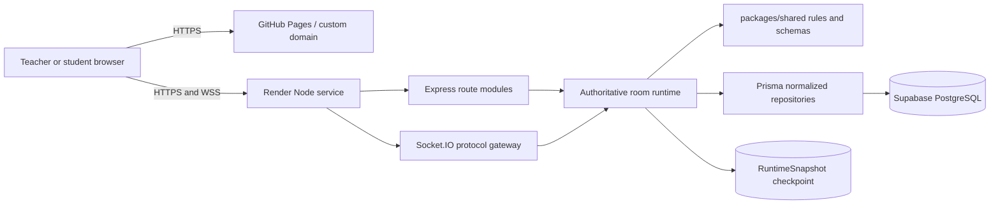
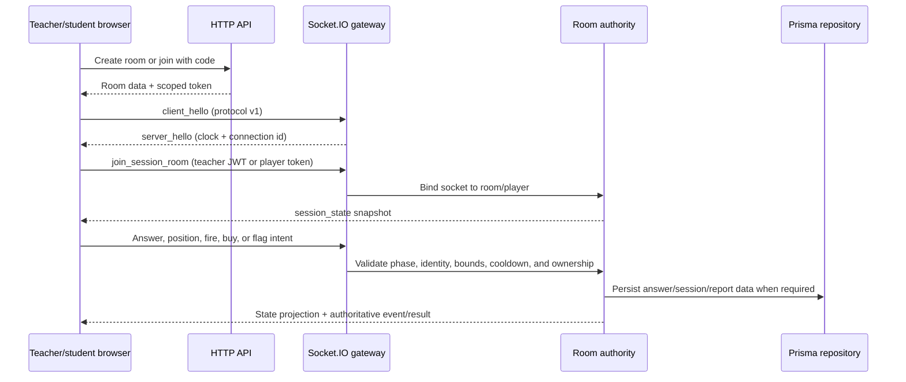

# QuizStrike architecture

Last verified: 5 August 2026
Current branch: `main`

This is the current-state architecture for GyakutenEigo / QuizStrike. The
browser game has moved beyond a quiz room with a simple tag loop: it now has
three server-authoritative modes, three authored arena maps, combat equipment,
an answer-driven economy, reconnect handling, character customization,
teacher spectator view, and two organizer-facing competition surfaces.

## System boundary

QuizStrike is a browser-based classroom product. The browser owns rendering,
input collection, local prediction, and presentation. The server owns identity,
room membership, quiz correctness, movement acceptance, combat, economy,
objectives, round transitions, bots, and reports.


```mermaid
flowchart LR
  Browser[Teacher or student browser]
  Browser -->|HTTPS| Web[GitHub Pages / custom domain]
  Browser -->|HTTPS and WSS| API[Render Node service]
  API --> HTTP[Express route modules]
  API --> Socket[Socket.IO protocol gateway]
  HTTP --> Room[Authoritative room runtime]
  Socket --> Room
  Room --> Rules[packages/shared rules and schemas]
  Room --> Durable[Prisma normalized repositories]
  Durable --> DB[(Supabase PostgreSQL)]
  Room --> Checkpoint[(RuntimeSnapshot checkpoint)]
```

Production is intentionally one Render Node instance. Live room state,
Socket.IO bindings, timers, bot memory, rate limits, in-memory room leases,
and uploaded decal bytes are process-local. Supabase is the durable database,
not the realtime game server. Redis adapters and distributed room state are not
implemented; `RUNTIME_STORE` must remain `in-memory`.

## Product surfaces

| Surface | Current responsibility |
| --- | --- |
| `/` | Public GyakutenEigo landing page and product entry points |
| `/quiz-strike` | QuizStrike landing page, teacher auth, library, reports, settings, competitions, and Tournament Center |
| `/join?code=ROOM` | Student nickname, team, and appearance join flow |
| `/game` | Student live room, quiz panel, shop, HUD, scoreboard, event feed, and arena |
| `/tournament-study/:id` | Released tournament study material |
| `/character-lab` | Development-only character/map rendering and performance harness |

The teacher flow is now four practical stages: choose the game mode, choose the
arena and mode rules, tune advanced settings, then invite students from the
waiting room. The waiting room provides a join code, QR code, roster, bot
controls, moderation, character-customization controls, and the Start Game
action. During play, Live Game Control exposes round actions and a read-only
Spectator View.

## Server composition

`apps/server/src/runtime.ts` is the composition root. It creates the Express
app, Socket.IO server, stores, persistence scheduler, room authority, lifecycle
timers, broadcasts, and feature dependencies. Keep feature logic in the
focused modules below rather than adding new route or simulation branches to
the composition root.

| Module | Responsibility |
| --- | --- |
| `apps/server/src/routes/authRoutes.ts` | Teacher signup/login and signed teacher tokens |
| `apps/server/src/routes/teacherLibrary.ts` | Teacher dashboard, classes, folders, and quiz library |
| `apps/server/src/routes/quizSets.ts` | Quiz-set creation, mutation, and ownership checks |
| `apps/server/src/routes/questions.ts` | Question CRUD and question-audio assets |
| `apps/server/src/routes/sessionRoutes.ts` | Room creation, start/end, bot management, round controls, and reports |
| `apps/server/src/routes/playerRoutes.ts` | Student join/rejoin, team selection, answers, purchases, and player HTTP commands |
| `apps/server/src/routes/appearanceRoutes.ts` | Appearance policy, decals, moderation, and cleanup |
| `apps/server/src/routes/reports.ts` | Teacher-only report retrieval, export, deletion, and history clearing |
| `apps/server/src/routes/competitionRoutes.ts` | Public/organizer competition lifecycle, rosters, announcements, check-in, and audit projection |
| `apps/server/src/routes/tournamentRoutes.ts` | Teacher-owned tournaments, study packs, invitation codes, teams, brackets, official rooms, and result linking |
| `apps/server/src/realtime/protocolGateway.ts` | Protocol v1 handshake, validation, version negotiation, and structured protocol errors |
| `apps/server/src/roundRuntime.ts` | Preparation, Zombie selection, buy phase, active rounds, deadlines, round results, and match completion |
| `apps/server/src/roundFlow.ts` | Pure round-action resolution and pending-round decisions |
| `apps/server/src/botRuntime.ts` / `botAI.ts` / `botNavigation.ts` | Bot state, navigation, firing, targeting, respawn, and difficulty behavior |
| `apps/server/src/combat.ts` | Server-side target selection, damage, elimination, respawn, and combat result flow |
| `apps/server/src/connectionLifecycle.ts` | Socket replacement, disconnect grace, flag drops, eviction, and runtime-state cleanup |
| `apps/server/src/freezeStreaks.ts` | Server-owned freeze streak increments, resets, thresholds, and announcement events |
| `apps/server/src/persistence/normalizedLibrary.ts` | Prisma-backed teacher library, question audio, sessions, players, answers, rounds, and reports |
| `apps/server/src/scaling/runtimeInfrastructure.ts` | In-memory room state, join-code directory, leases, event bus, idempotent consumers, and lifecycle timers |

There is one bot scheduler and one round/deadline scheduler. Route modules
receive explicit dependencies from `runtime.ts`, which keeps authorization and
side effects testable and prevents a second hidden runtime from being created.

## Browser composition

`apps/web/src/features/quizstrike/QuizStrikeApp.tsx` is still the product-level
hub, but live gameplay is split into feature components and game modules.

| Area | Current owners |
| --- | --- |
| HTTP and API fallback | `apps/web/src/api/client.ts` and `studentCommandTransport.ts` |
| Socket connection and handshake | `apps/web/src/features/multiplayer/connection.ts` |
| Student live state | `features/quizstrike/student/useStudentGameState.ts` |
| Quiz, shop, event feed, preferences, scoreboard | `student/QuizPanel.tsx`, `BuyPanel.tsx`, `EventFeed.tsx`, `GamePreferencesPanel.tsx`, `Scoreboard.tsx` |
| Teacher live controls | `teacher/useSessionControls.ts` and the teacher sections in `QuizStrikeApp.tsx` |
| Competition organizer UI | `competition/CompetitionHub.tsx` |
| Tournament UI | `tournament/TournamentCenter.tsx`, `TournamentRegistrationPage.tsx`, `TournamentStudyPage.tsx` |
| Three.js scene | `game/ArenaPreview.tsx`, `sceneSetup.ts`, `arenaLoop.ts`, `inputHandling.ts` |
| Map geometry and art | `arenaMapBuilder.ts`, `mapLoader.ts`, `desertCitadelMap.ts`, `ironJunctionMap.ts`, `templeRunoffMap.ts` |
| Characters and network transforms | `characterSync.ts`, `characters/CharacterManager.ts`, `CharacterNetworkState.ts`, `CharacterController.ts` |
| HUD and objective presentation | `hudOverlay.tsx`, `ArenaMinimap.tsx`, shared announcement components |
| VFX, audio, and preferences | `ArenaVfx.ts`, `GameAudio.ts`, `GameplayAnnouncements.ts`, `gamePreferences.ts` |

The arena has one requestAnimationFrame loop. Cleanup must stop the loop,
remove browser listeners, unsubscribe animation/VFX handlers, dispose pooled
resources and the renderer canvas, and avoid remounting the whole scene on each
Socket.IO snapshot. Rendered meshes and client visuals must not become a
second source of collision or combat truth.

## State ownership

| State | Owner | Persistence / transport |
| --- | --- | --- |
| Protocol schemas, game types, map IDs, bounds, constants, and pure rules | `packages/shared` | Imported by both browser and server |
| Teacher auth, library, quiz sets, questions, classes, folders | Server and Prisma | Normalized PostgreSQL models |
| Active room lifecycle, players, timers, combat, bots, objectives, announcements | Room authority on the server | Process memory; checkpointed when required |
| Reports, answer logs, round logs, player/session history | Server persistence boundary | Normalized PostgreSQL models |
| `RuntimeSnapshot` row `primary` | Recovery checkpoint / legacy migration source | PostgreSQL JSON; not the source of truth for new library writes |
| Socket bindings, disconnect grace, question gates, rate limits, request dedupe, decals | Server process | Process memory; cleaned on room/player end |
| Camera, animation, VFX, audio, minimap, local target selection, muted state | Browser | Presentation state only |

The normalized Prisma schema currently includes users, classes, quiz sets,
folders, questions, question audio, sessions, players, answer logs, round
logs, reports, `RuntimeSnapshot`, the Competition platform, and Tournament
Center models. Prisma is the only application database client. The browser does
not use Supabase Auth, Supabase Realtime, the Supabase Data API, or Supabase
Storage.

The migration
`prisma/migrations/20260805000000_harden_public_tables_rls/migration.sql`
enables RLS on application tables that exist and revokes `anon` and
`authenticated` table privileges when those roles exist. Keep this aligned with
the server-only Prisma access model and verify the target Supabase project
after deployment.

## Request and realtime flow


```mermaid
sequenceDiagram
  participant T as Teacher/student browser
  participant H as HTTP API
  participant G as Socket.IO gateway
  participant R as Room authority
  participant P as Prisma repository

  T->>H: Create room or join with code
  H-->>T: Room data + scoped token
  T->>G: client_hello (protocol v1)
  G-->>T: server_hello (clock + connection id)
  T->>G: join_session_room (teacher JWT or player token)
  G->>R: Bind socket to room/player
  R-->>T: session_state snapshot
  T->>G: Answer, position, fire, buy, or flag intent
  G->>R: Validate phase, identity, bounds, cooldown, and ownership
  R->>P: Persist answer/session/report data when required
  R-->>T: State projection + authoritative event/result
```

Socket.IO is the primary live transport. Student answer/purchase commands also
have HTTP routes, and the browser transport chooses Socket.IO acknowledgements
when connected with an HTTP fallback. Purchases must not be retried through two
transports for the same action because that could charge twice.

The canonical protocol is version 1. The server temporarily recognizes an
unversioned legacy client as inferred version 0 for rollout compatibility; an
explicit unsupported version is rejected. See
[`packages/shared/PROTOCOL.md`](packages/shared/PROTOCOL.md) before changing
event names, payload bounds, timestamp semantics, or reconnect behavior.

## Current game model

### Session phases

Rooms begin in `waiting`. A started room enters:

1. `preparation` for Flag and Classic Tag, or `zombie_selection` for Zombie;
2. `buy` when the inter-round shop is available;
3. `active` for the round;
4. `paused` for the round result/transition when applicable;
5. the next round or `ended` when the match is complete.

Dead students may practice if `deadPlayersCanPractice` is enabled. The default
is enabled, but dead players do not earn money by default. Three correct
practice answers are required for the configured respawn path. Round deadlines
and absolute timestamps are server-owned; clients estimate display time from
the latest server clock and render local countdowns.

### Modes

| Mode | Server-owned objective and result |
| --- | --- |
| Classic Tag | Teams freeze/tag opposing players. Round winner is resolved from tags and respawns, with quiz earnings breaking ties. |
| Flag | Red picks up the flag, carries it into the Blue base, and holds it for the configured duration. Blue can capture after placement. Elimination and timeout rules are server-evaluated. |
| Zombie | The selection phase chooses initial Red Zombies; Blue Humans answer and use energy to survive. A valid human elimination converts that player into a Red Zombie. The match ends when no humans remain or time expires with humans surviving. |

Flag state is authoritative and reconstructible: `available`, `carried`,
`dropped`, `being_placed`, `placed`, `being_captured`, `captured`, `expired`,
and `resetting`. Placement/capture progress, carrier, objective ID, position,
and server timestamps are part of the session projection. Disconnecting a flag
carrier drops the flag before disconnect grace resolves.

### Maps and movement

The current map pool is:

- Desert Citadel;
- The Iron Junction;
- Temple Runoff.

Each map has authored static geometry, multi-level surfaces or routes where
applicable, team bases/spawns, objective/search areas, visual props, signs,
and map-aware collision/navigation data. The client builds the Three.js scene;
the server/shared package applies authoritative movement bounds, collision,
spawns, and target range checks. Do not use mesh visibility or raycast results
as the authoritative rule.

### Combat, economy, and streaks

The live pipeline is:

1. the browser sends a fire intent with request ID, position/aim, and optional
   target/zoom data;
2. the protocol gateway validates the payload and the server deduplicates the
   request, checks room/phase/cooldown/ammunition, and applies authoritative
   position checks;
3. shared range, team, hit-radius, health, and damage rules resolve the action;
4. the server emits damage/elimination/world-impact/presentation events and
   broadcasts the resulting player state.

Current gear is intentionally school-safe and uses snowball terminology:

| Slot | Item | Current behavior |
| --- | --- | --- |
| Weapon | Starter Snowball Launcher | Default weapon; range 36 |
| Weapon | Quick Snowball Launcher | Cost 4,000; range 48; damage 20; 250 ms cooldown; automatic fire behavior |
| Weapon | Heavy Snowball Launcher | Cost 9,000; damage 80; 150 range; 1,500 ms cooldown; scoped FOV steps 72/40/20 |
| Perk | Warm Vest | Adds 70 health |
| Perk | Speed Boots | Adds health and 30% movement speed |

Weapon and perk slots are independent. Answer rewards, fast-answer bonuses,
starting money, snowball packs, penalties, round duration, and player limits
are room settings sanitized by `packages/shared`. Freeze streaks are not
client-controlled: validated eliminations increment them, hits/round changes/
team changes/removal/disconnect cleanup reset them, and milestones 3 through 8
emit deduplicated announcement events.

### Bots

Bots use the same authoritative room pipeline as students for movement,
targeting, firing, respawn, answer participation, and objective behavior.
Difficulty is `beginner`, `standard`, or `advanced`. Bot score can affect a live
match, while bots are excluded from teacher learning reports where the report
logic distinguishes them from learners.

### Character customization

Customization is ephemeral room state by default. The current policy defaults
to enabled, with uploads and AI skin generation disabled, `persistAcrossSessions`
false, and no browser-to-Supabase asset path. Teachers can opt into remembering
compact appearance choices; signed cosmetic progress can also be carried into a
later classroom. Uploaded/processed decals remain ephemeral regardless of that
setting. Decals are authenticated against the player token, bounded in size and
dimensions, stripped of EXIF/GPS data, kept outside `session_state`, and removed
on player/session cleanup, policy reset, expiry, or process restart. Teacher
controls can clear individual appearances, remove decal assets, or reset the
room appearance policy.

## Authorization and data safety

- Teacher operations require a signed teacher JWT and ownership checks.
- Student HTTP and Socket.IO operations require a room-scoped player token
  bound to the player ID and session code.
- The server never trusts a client user ID, team, score, answer correctness,
  damage result, currency balance, target, or position.
- Student question payloads do not include `correctChoice`.
- Socket payloads are schema-validated, reject unknown/invalid fields, enforce
  numeric bounds, and are capped at 16 KiB.
- Reports and history deletion are teacher-scoped; public competition and
  tournament projections omit private roster or answer data.
- `DATABASE_URL` and `JWT_SECRET` are server-only. `VITE_*` variables are
  public build inputs and must never contain database credentials or Supabase
  secrets.
- Supabase Data API access is outside the product boundary. The application
  connects through Prisma using the protected PostgreSQL URL.

## Scaling and failure boundaries

Room ownership currently uses in-memory leases and fencing tokens. Only the
owner evaluates bot ticks, deadlines, round conclusions, and live mutation.
Reconnects perform a fresh protocol handshake and receive a complete
authoritative snapshot. Absolute deadlines survive a process checkpoint, but
process-local sockets, timers, bots, rate limits, and decals do not survive a
restart without rejoin/reconstruction.

Do not add Render replicas until all of the following are implemented and
integration-tested together:

- a shared room-state store and join-code directory;
- distributed room leases/fencing with takeover behavior;
- Socket.IO adapter and cross-instance event fan-out;
- reconnect routing to the room owner;
- distributed rate limits and request deduplication;
- durable or object-backed decal storage;
- two-instance failure, duplicate-event, and split-brain tests.

`RUNTIME_STORE=redis` currently fails closed by design.

## Safe change rules

1. Put reusable types, schemas, constants, bounds, and pure game rules in
   `packages/shared`.
2. Keep outcome mutation in the authoritative server path; browser changes are
   presentation unless explicitly designed as intent.
3. Keep rendered meshes separate from collision and hit proxies.
4. Keep weapon and perk slots independent.
5. Preserve the no-correct-choice student payload invariant.
6. Use server epoch milliseconds for protocol deadlines and ISO strings only
   for established durable/display snapshot fields.
7. Preserve stable UUID event IDs and client/server deduplication behavior.
8. Bound, authenticate, expire, and clean up all decal bytes.
9. Preserve school-safe wording and the snowball/arena vocabulary.
10. Treat `packages/shared/PROTOCOL.md` as the contract before changing live
    event names or payloads.

## Validation snapshot

The current local validation record for this documentation refresh is:

- `npm test` passed;
- `npm run build` passed;
- `npx prisma validate` passed with a local/dummy `DATABASE_URL`;
- `git diff --check` passed.

Run the broader release checks before deployment:

```powershell
npm run lint
npm run typecheck
npm test
npm run build
npm run test:load
npm run test:e2e
npx prisma validate
```

For deployment and classroom verification, see
[`docs/online-play.md`](docs/online-play.md). For operator state and current
known limitations, see [`HANDOFF.md`](HANDOFF.md).
