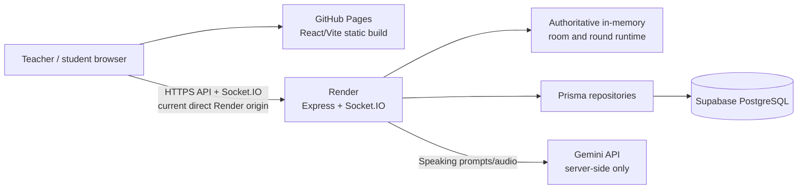

# GyakutenEigo architecture

**Current-state summary — verified 1 September 2026 at commit `76840ec`.**

The detailed, authoritative system description is
[`SYSTEM.md`](SYSTEM.md). This file is the compact architecture map for
developers changing boundaries, authority, persistence, networking, or
scaling. If this summary conflicts with code or `SYSTEM.md`, stop and update
the source-of-truth document before proceeding.

## Topology


```mermaid
flowchart LR
  Browser[Teacher / student browser]
  Pages[GitHub Pages<br/>React/Vite static build]
  API[Render<br/>Express + Socket.IO]
  Runtime[Authoritative in-memory<br/>room and round runtime]
  Prisma[Prisma repositories]
  DB[(Supabase PostgreSQL)]
  Gemini[Gemini API<br/>server-side only]

  Browser --> Pages
  Browser -->|HTTPS API + Socket.IO<br/>current direct Render origin| API
  API --> Runtime
  API --> Prisma --> DB
  API -->|Speaking prompts/audio| Gemini
```

The live public website is `gyakuteneigo.com`/`www.gyakuteneigo.com` on GitHub
Pages. The live API is `api.gyakuteneigo.com` and the Render native hostname.
The checked-in Cloudflare Worker is a prepared future proxy; the website
`/api/*` path is currently a Pages 404, so the production web build keeps the
explicit Render origin enabled.

## Boundary ownership

| Boundary | Owner | Rule |
| --- | --- | --- |
| Browser route selection | `apps/web/src/BrowserApp.tsx`, `navigation.ts` | Small History API router; direct SPA paths need Pages fallbacks |
| Teacher/library HTTP | `apps/server/src/routes/teacherLibrary.ts`, `studySets.ts`, `quizSets.ts`, `questions.ts`, `reports.ts` | JWT plus teacher ownership checks |
| Room HTTP | `apps/server/src/routes/sessionRoutes.ts`, `playerRoutes.ts` | Teacher JWT creates/controls rooms; scoped player tokens join/rejoin |
| Socket binding | `realtime/protocolGateway.ts`, `realtime/roomAuthority.ts`, `connectionLifecycle.ts` | Validate protocol, authenticate, bind to one room, emit role-scoped state |
| Round lifecycle | `roundRuntime.ts`, `roundFlow.ts` | Server owns phases, deadlines, scoring, pause/resume, and conclusions |
| Combat/objectives | `combat.ts`, runtime flag handlers, `botRuntime.ts` | Server validates position/intent and resolves damage, flags, respawns, and bots |
| Athletics | `athleticsAuthority.ts`, `athleticsModeAuthority.ts`, shared Athletics modules | Server owns course progress, energy, role/variant rules, hazards, and race results |
| Speaking | `routes/speakingRoutes.ts`, `speakingProviders.ts`, `speakingRepository.ts` | Server receives bounded audio/text and calls the selected provider; keys never reach browser |
| Durable storage | `persistence/normalizedLibrary.ts`, `persistenceScheduler.ts`, Prisma | PostgreSQL is authoritative for teacher/library/history/Speaking records |
| Runtime checkpoint | `RuntimeSnapshot` and runtime hydration helpers | Recovery/backfill aid for active rooms, not the new library authority |

The browser can predict presentation, but the server decides correctness,
damage, money, eliminations, objectives, round results, bot behavior, and
authoritative positions. Public student projections omit `correctChoice`,
teacher-only fields, and Learning Pulse.

## Runtime state model

The deployed service is intentionally single-instance:

- process-local rooms, join-code directory, room leases/fencing, sockets,
  timers, bot memory, disconnect grace, rate limits, deduplication caches, and
  transient decal/projectile/hazard state;
- normalized Prisma data for users, classes, quiz sets, folders, questions,
  audio, sessions, players, answers, rounds, reports, competitions,
  tournaments, and Speaking Practice;
- `RuntimeSnapshot` id `primary` for recoverable active-session state and old
  migration/backfill compatibility.

`RUNTIME_STORE=redis` is rejected. Do not add replicas until distributed room
ownership/takeover, Socket.IO fan-out, reconnect routing, rate limits and
deduplication, and object-backed decal storage are implemented and tested.

## Browser and product boundaries

The main browser surface is:

- `/` public home;
- `/quiz-strike` QuizStrike landing/auth/competition entry;
- `/quiz-strike/teacher/*` unified teacher workspace;
- `/join?code=ROOM` and `/game` student classroom flow;
- `/speak`, `/speak/join/:activityCode`, `/speak/session/:sessionId`, and
  `/speak/result/:participantId` Speaking Practice flow;
- `/quiz-strike/organizer`, competition/tournament routes, and
  `/tournament-study/:id` competition features;
- `/check` and `/diagnostics` network diagnostics;
- `/character-lab` local-only rendering harness.

QuizStrike `GameMode` values are `classic`, `flag`, `zombie`, and `athletics`.
Athletics variants are Classic Athletics, Zeus, Hunters & Runners, and Chaos
Climb. Standard arena maps are Desert Citadel, Iron Junction, and Temple
Runoff; Athletics uses the authored Stadium Loop course.

## Realtime protocol

The canonical Socket.IO protocol is version 1, defined in
`packages/shared/src/protocol`. The temporary server-only legacy adapter may
recognize unversioned version-0 clients during rollout, but version 0 is not a
supported browser contract.

Connection sequence:

1. Socket.IO connects.
2. Browser sends `client_hello` with protocol version 1.
3. Server returns `server_hello` with connection id and server time.
4. Browser sends `join_session_room` with either teacher JWT or player token.
5. Server validates credentials, joins a role-scoped room, and emits a
   sanitized authoritative `session_state`.

Commands are schema-validated, bounded to 16 KiB, and range checked before
game logic. Reconnect repeats the sequence. Read the full wire contract in
[`packages/shared/PROTOCOL.md`](packages/shared/PROTOCOL.md).

## Deployment boundary

### Render API

```text
npm ci --include=dev && npm run build -w @quizstrike/shared && npm run build -w @quizstrike/server
npm start -w @quizstrike/server
```

`apps/server/src/start.ts` runs `prisma migrate deploy` when
`DATABASE_URL` is configured, then imports the runtime. Render currently uses
the Supabase session pooler on port 5432. Speaking is production Gemini mode:

```text
SPEAKING_MOCK_MODE=false
SPEAKING_AI_PROVIDER=gemini
SPEAKING_TRANSCRIPTION_PROVIDER=gemini
SPEAKING_GEMINI_API_KEY=<Render secret>
SPEAKING_GEMINI_MODEL=gemini-2.5-flash-lite
SPEAKING_GEMINI_TRANSCRIPTION_MODEL=gemini-2.5-flash-lite
```

### GitHub Pages web

`.github/workflows/deploy-web.yml` builds `apps/web/dist` on Node 22 and
creates SPA fallbacks. Its current compatibility defaults are:

```text
VITE_BASE_PATH=/
PAGE_CUSTOM_DOMAIN=www.gyakuteneigo.com
VITE_API_URL=https://gyakuteneigo-api.onrender.com
VITE_ALLOW_PRODUCTION_API_OVERRIDE=true
```

The Cloudflare Worker in `infrastructure/cloudflare` only becomes part of the
architecture after DNS is delegated to Cloudflare, routes are deployed, and
both API and Socket.IO checks pass through the website origin.

## Change rules

Before changing a boundary:

1. update shared types/schemas first when the wire contract changes;
2. keep the server-compatible release deployed before the matching browser;
3. preserve teacher ownership, player-token scope, and student payload
   redaction;
4. keep raw Speaking audio and server secrets out of durable/client payloads;
5. keep migrations additive and release them through `prisma migrate deploy`;
6. keep one Render instance while live state is process-local;
7. run `npm run lint`, `npm run typecheck`, `npm test`, and `npm run build`.

For release procedure, health checks, rollback, and the known gaps, use
[`HANDOFF.md`](HANDOFF.md) and [`SYSTEM.md`](SYSTEM.md).
