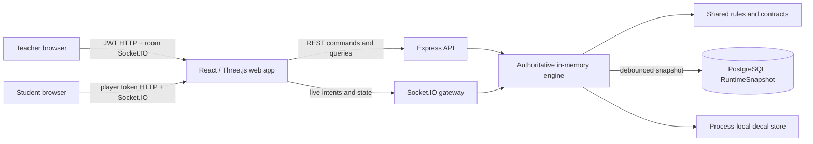
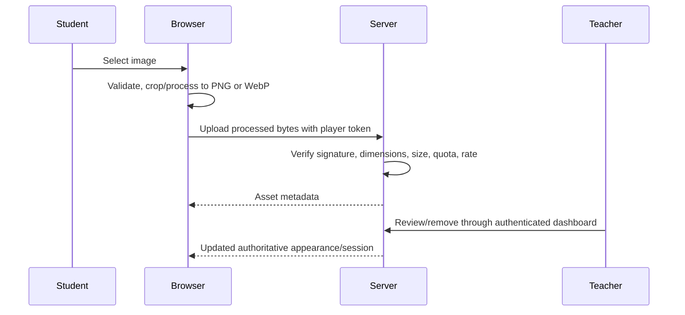
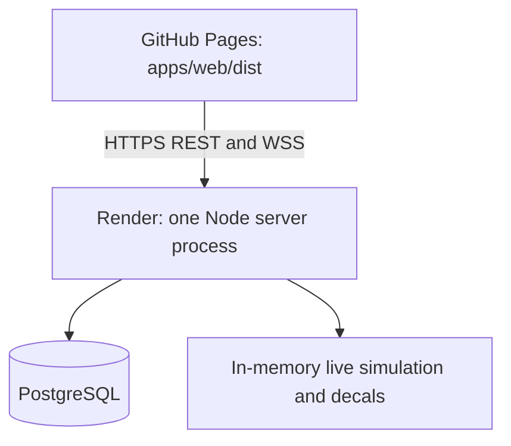

# QuizStrike Architecture

Last verified: 2026-07-29 against `main` at `8e19028`

## 1. System purpose

QuizStrike is the first game inside the GyakutenEigo browser learning site. A teacher creates a multiple-choice quiz and a private classroom session. Students join with a room code, answer questions for in-game currency, buy school-safe equipment, and play a live Three.js arena match.

The system is a TypeScript npm-workspace monorepo with three runtime boundaries:

- `apps/web`: React single-page application and Three.js game client.
- `apps/server`: Express, Socket.IO, authoritative game simulation, and persistence adapter.
- `packages/shared`: shared contracts and deterministic rules used by both runtimes.


```mermaid
flowchart LR
    T["Teacher browser"] -->|JWT HTTP + room Socket.IO| W["React / Three.js web app"]
    S["Student browser"] -->|player token HTTP + Socket.IO| W
    W -->|REST commands and queries| API["Express API"]
    W -->|live intents and state| IO["Socket.IO gateway"]
    API --> E["Authoritative in-memory engine"]
    IO --> E
    E --> K["Shared rules and contracts"]
    E -->|debounced snapshot| DB[("PostgreSQL RuntimeSnapshot")]
    E --> D["Process-local decal store"]
```

The browser can predict presentation, but it does not own health, eliminations, money, purchases, objectives, round results, or final positions.

## 2. Repository boundaries

| Area | Primary responsibility | Important entry points |
| --- | --- | --- |
| Root | Workspace scripts, environment examples, Prisma schema | `package.json`, `.env.example`, `prisma/schema.prisma` |
| Shared package | Domain types, defaults, validation, collision data, combat/economy/objective rules, reports | `packages/shared/src/index.ts` |
| Server | Auth, teacher CRUD, sessions, student access, simulation, bots, sockets, persistence, decals | `apps/server/src/index.ts` |
| Web application | Navigation, teacher dashboard, student lifecycle, HUD, quiz/shop/report UI | `apps/web/src/App.tsx` |
| API client | API URL failover, wake-up/retry behavior, auth/player headers, typed call groups | `apps/web/src/api/client.ts`, `apps/web/src/api/endpoints.ts` |
| Arena | FPS input, camera, local prediction, scene assembly, collision proxies, minimap, VFX | `apps/web/src/game/ArenaPreview.tsx` |
| Characters | Shared skinned mesh, appearances, equipment, LOD, animation, network smoothing | `apps/web/src/game/characters/` |
| Maps | Map metadata and rendered implementations | `apps/web/src/game/arenaMaps.ts`, `desertCitadelMap.ts`, `ironJunctionMap.ts` |

`App.tsx` and the server `index.ts` are intentionally the current integration hubs, but both are large monoliths. New isolated rules should go into shared or focused modules rather than making either hub larger without need.

## 3. Web application

### Routes

The application uses a small History API router implemented in `navigation.ts` and `App.tsx`; there is no React Router dependency.

| Route | Purpose |
| --- | --- |
| `/` | GyakutenEigo public landing page |
| `/quiz-strike` | QuizStrike landing, teacher authentication, and authenticated dashboard |
| `/join?code=ROOM` | Student room-code and nickname entry |
| `/game` | Student arena after a successful join or rejoin |
| `/character-lab` | Development-only character/map/performance harness |

The teacher JWT is stored in `localStorage` under `quizstrike_token`. Student rejoin credentials are stored separately under `quizstrike_student_session`; appearance preferences use `quizstrike_student_appearance_v1`.

### Client state

`App.tsx` owns the teacher dashboard and student session lifecycle. The arena is lazy-loaded so the public and teacher screens do not pay the Three.js startup cost. `CharacterCreator` is also lazy-loaded.

The student client:

1. Joins or rejoins over HTTP and receives a private `playerToken`.
2. Connects to Socket.IO and binds the socket with room code, player ID, and token.
3. Receives full `session_state` snapshots at lifecycle boundaries, focused
   `player_state` changes, batched bot positions, and combat/presentation events.
4. Sends compact position, fire, and flag intents over its already authenticated
   Socket.IO binding.
5. Sends answer and purchase commands through acknowledged socket commands when connected, with authenticated HTTP endpoints available as fallback.
6. Renders optimistic movement and firing feedback while reconciling authoritative state.

API startup can try multiple server candidates. `VITE_API_URL` is preferred; hosted builds may fall back to `VITE_API_FALLBACK_URL` or the configured default when the primary endpoint has a network-level failure.

## 4. Shared domain kernel

`packages/shared/src/index.ts` is the contract between browser and server. It owns:

- `GameSession`, `PlayerSession`, `SessionSettings`, quiz, report, event, appearance, map, team, and mode types.
- Default and sanitized session settings.
- Nickname/session/appearance safety validation.
- Map bounds, spawn data, team bases, objectives, and simplified obstacles.
- Authoritative movement clamping and speed checks.
- Gear, independent weapon/perk loadout slots, snowball use, purchases, range, cooldown, and hit radius.
- Projectile targeting and line-of-sight checks.
- Flag Mode, Zombie Mode, Classic Tag Practice, round, respawn, and bot decision rules.
- Scoreboard and CSV report construction.

Deterministic business/game rules belong here when both runtimes need the result. Browser-only rendering and input behavior do not.

## 5. Authoritative server

### Runtime model

The server holds active state in process memory:

- teachers, classes, quiz sets, sessions, and answer logs;
- question issuance gates and rate-limit state;
- socket-to-player bindings and disconnect grace timers;
- movement/fire timestamps and bot timers;
- uploaded decal bytes.

The main simulation loop advances bots every 450 ms. Bot motion is sent as one
batched volatile `player_positions` delta to student sockets; state-changing bot
actions use focused player deltas. Full session snapshots are coalesced into a
75 ms broadcast window. Persistence writes are debounced by one second.

### Authentication and access

- Teacher endpoints use a Bearer JWT created after email/password signup or login.
- Passwords use bcrypt hashes.
- Students use an opaque per-player token returned at join.
- Student HTTP routes require `X-Player-Token`.
- Student sockets become trusted only after `join_session_room` binds a valid room, player, and token.
- Teacher room subscriptions require the teacher JWT and verify session ownership.
- Full session HTTP reads require either the owning teacher JWT or a player token from that room.
- Production startup fails when the default development JWT secret is still configured.
- CORS origins come from `CLIENT_ORIGIN` or `CORS_ORIGIN`.

### HTTP API groups

| Group | Operations |
| --- | --- |
| Health | `/health`, `/api/health` |
| Auth | signup, login, current teacher |
| Teacher content | dashboard, classes, quiz sets, question create/update/delete |
| Sessions | create, start, end, add bot, read state, JSON/CSV report |
| Student | join, rejoin, choose team, request question, answer, buy gear, buy snowballs |
| Customization | update appearance, upload/fetch/list/delete decals, policy update, player/all reset |

`apps/web/src/api/client.ts` is the browser-side catalog for these calls. Treat it as the practical API index; `packages/shared/PROTOCOL.md` is useful background but may lag newer acknowledged socket commands.

### Socket.IO protocol

Client intents:

| Event | Role |
| --- | --- |
| `join_session_room` | Subscribe teacher or authenticate/bind a student socket |
| `answer_question` | Bound-student command with acknowledgement |
| `buy_gear` | Bound-student command with acknowledgement |
| `buy_snowballs` | Bound-student command with acknowledgement |
| `player_position` | Authenticated movement intent |
| `fire_action` | Authenticated shot intent with request ID and optional scope state |
| `flag_action` | Authenticated objective interaction intent |

Server messages:

| Event | Role |
| --- | --- |
| `session_state` | Authoritative room snapshot |
| `player_state` | Changed authoritative player records, flag state, and recent events |
| `player_position` | Volatile remote movement update |
| `player_positions` | Batched volatile server-owned bot movement |
| `remote_weapon_fire` | Presentation event for other clients |
| `damage_result` | Validated hit or rejected-shot result |
| `elimination_update` | Focused elimination/reward event |
| `world_impact` | Shared impact VFX location |
| `game_event` | Join, timer, round, hit, and elimination feed item |
| `error_message` | User-facing rejected-action message |

### Persistence

The Prisma schema contains a future normalized classroom model, but the running application currently persists only one JSON row:

```text
RuntimeSnapshot(id = "primary")
  ├── users
  ├── classes
  ├── quizSets (including questions)
  ├── sessions (including players and settings)
  └── answers
```

When `DATABASE_URL` exists, `apps/server/src/start.ts` runs committed migrations before importing the server. The engine hydrates the snapshot at startup and mirrors mutations back through a serialized persistence queue. Without `DATABASE_URL`, everything is in memory and a restart erases classroom data.

Uploaded decal bytes are an intentional exception. `DecalStore` is process-local, capped at 32 MiB per room, and pruned after eight hours. Persisted player appearances have `decalAssetId` removed during hydration, so a restart cannot leave broken asset references.

This architecture requires a single server instance. Horizontal scaling needs a shared Socket.IO adapter, distributed timers/locks, shared live state, and shared decal/object storage before multiple replicas are safe.

## 6. Game simulation and rendering

### Authority boundary

| Concern | Browser | Server/shared |
| --- | --- | --- |
| Input and camera | Owns | Receives intent only |
| Immediate movement feel | Predicts | Clamps speed/bounds and republishes |
| Shot animation and sound | Predicts | Validates request ID, cooldown, ammo, range, cover, target, damage |
| Health, alive state, score, money | Displays | Owns |
| Quiz correctness and rewards | Displays response | Owns |
| Purchases and loadout | Requests | Validates funds, life state, and base rule |
| Flag/Zombie/round result | Displays | Owns |
| Rendered geometry and effects | Owns | Owns simplified collision/cover metadata only |

The rendered map is not the collision source of truth. `ArenaPreview` creates invisible client collision proxies aligned with shared simplified obstacles, then renders separate modular shells and decorations. A visual art edit must not silently change gameplay geometry.

Static scenery is atlas-batched. Characters share a `THREE.SkinnedMesh` skeleton and palette-cached body geometry, while equipment stays modular. Remote animation is reconstructed from network state rather than synchronizing bones. VFX pools are bounded by quality preset.

Current maps are Desert Citadel and The Iron Junction. The controller supports horizontal arena movement with a small vertical component, but the game is still fundamentally ground-plane based; visually elevated routes are not a general traversal system.

## 7. Character customization

The shared appearance contract contains an approved character preset and bounded cosmetic fields. The server sanitizes every update and enforces the teacher's room policy.

The upload path is:


```mermaid
sequenceDiagram
    participant Student
    participant Browser
    participant Server
    participant Teacher
    Student->>Browser: Select image
    Browser->>Browser: Validate, crop/process to PNG or WebP
    Browser->>Server: Upload processed bytes with player token
    Server->>Server: Verify signature, dimensions, size, quota, rate
    Server-->>Browser: Asset metadata
    Teacher->>Server: Review/remove through authenticated dashboard
    Server-->>Browser: Updated authoritative appearance/session
```

The shipped AI skin provider is unavailable by design. `SkinGenerationProvider.ts` defines a future boundary, while server policy remains fail-closed until a moderated, authenticated server adapter exists. Provider secrets must never be exposed through `VITE_*` variables.

## 8. Deployment


```mermaid
flowchart TB
    WEB["GitHub Pages: apps/web/dist"] -->|HTTPS REST and WSS| SERVER["Render: one Node server process"]
    SERVER --> PG[("PostgreSQL")]
    SERVER --> MEM["In-memory live simulation and decals"]
```

The repository is configured for this hosted topology:

| Purpose | Configured address |
| --- | --- |
| Public site and game client | `https://www.gyakuteneigo.com` |
| Apex web entry point | `https://gyakuteneigo.com` |
| Primary API and Socket.IO | `https://api.gyakuteneigo.com` |
| API fallback | `https://gyakuteneigo-api.onrender.com` |
| Alternate GitHub Pages origin | `https://susume.github.io` |

`.github/workflows/deploy-web.yml` builds the shared package and web app, creates SPA fallback copies, and deploys `apps/web/dist` to GitHub Pages. The browser tries the configured primary API first and reuses a reachable fallback for subsequent HTTP and Socket.IO traffic. The Node service and PostgreSQL are deployed separately.

- Build order is shared, server, then web.
- The web host must rewrite SPA routes to `index.html`.
- The Node host must support long-lived WebSocket connections.
- `VITE_*` values are compiled into the web bundle; server variables are runtime values.
- Required production values are a real `JWT_SECRET`, `DATABASE_URL`, public `VITE_API_URL`, and correct `CLIENT_ORIGIN`.
- `TRUST_PROXY=true` is expected behind a trusted reverse proxy.

See `docs/online-play.md` for the current hosting checklist.

## 9. Architectural invariants

Preserve these rules:

1. Never trust a browser-provided result; accept intents and calculate outcomes on the server.
2. Keep reusable deterministic rules and contracts in `packages/shared`.
3. Keep rendered meshes separate from gameplay collision proxies.
4. Keep weapon and perk slots independent; buying a perk must not replace a launcher.
5. Never return a question's correct choice through the public question shape.
6. Require teacher ownership for teacher data and a player token for student-private operations.
7. Keep decal bytes private, bounded, authenticated, expiring, and absent from runtime snapshots.
8. Keep the school-safe vocabulary and content policy in `README.md`.
9. Treat `RuntimeSnapshot` as the real persistence model until the server is migrated to normalized repositories.
10. Do not run multiple server replicas until live state and Socket.IO coordination are externalized.

## 10. Known architecture debt

- `apps/server/src/index.ts` combines transport, repositories, simulation, and lifecycle orchestration.
- `apps/web/src/App.tsx` combines routing and most teacher/student product flows.
- Shared HTTP and Socket.IO payloads are not all represented by a dedicated versioned protocol module.
- The normalized Prisma models are not used by the runtime engine.
- Live timers, socket bindings, rate limits, bots, and decals are process-local.
- Full session payloads remain unprojected and relatively large, although their
  HTTP and Socket.IO read paths are authenticated and recurring gameplay changes
  now use deltas.
- Character/environment art is primarily code-authored; final artist-authored GLB assets remain a separate art gate.
- Physical Chromebook/Edge and ten-minute soak certification are still pending.

## 11. Verification boundaries

Run from the repository root:

```bash
npm run typecheck
npm test
npm run build
npm run test:load
npm run test:e2e
```

Unit tests cover shared rules, server flows/security, and web helpers. The load target exercises 40 authenticated Socket.IO clients. Playwright covers the built classroom flow. Rendering changes still require a visual pass on both maps and all quality presets; performance claims require the device matrix in `docs/performance/CHROMEBOOK_CERTIFICATION.md`.
