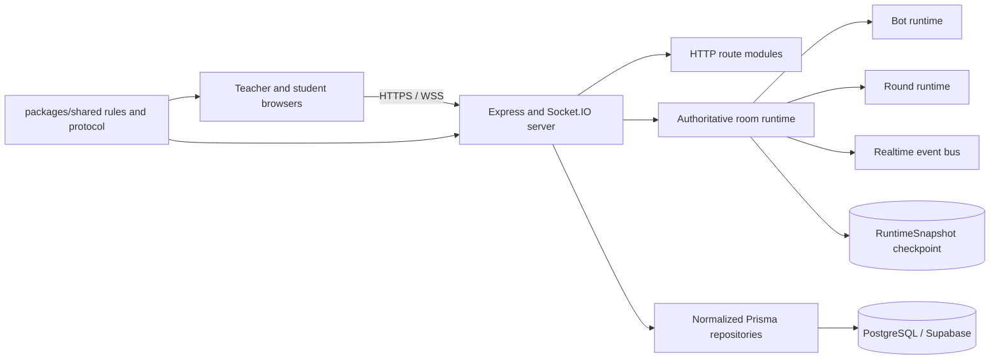

# QuizStrike Architecture

Last verified: 2 August 2026
Current branch: `main`
Validated state: architecture and teacher-workspace documentation refreshed; production topology unchanged

## System boundary

QuizStrike is a browser-based classroom game. The browser renders the teacher
and student experiences and sends authenticated intent. The server and shared
package own authoritative outcomes.

```mermaid
flowchart LR
  Browser[Teacher and student browsers]
  Browser -->|HTTPS / WSS| Server[Express and Socket.IO server]
  Server --> Routes[HTTP route modules]
  Server --> Room[Authoritative room runtime]
  Room --> Bots[Bot runtime]
  Room --> Rounds[Round runtime]
  Room --> Events[Realtime event bus]
  Server --> Repos[Normalized Prisma repositories]
  Repos --> DB[(PostgreSQL / Supabase)]
  Room --> Snapshot[(RuntimeSnapshot checkpoint)]
  Shared[packages/shared rules and protocol] --> Server
  Shared --> Browser
```

The current production topology is one Render Node instance with sticky room
affinity and Supabase PostgreSQL. Live room state, Socket.IO bindings, timers,
bot memory, rate limits, and decal bytes remain process-local. Redis and
multi-instance adapters are intentionally not enabled.

## Server ownership

`apps/server/src/runtime.ts` is the composition root. It wires configuration,
stores, Socket.IO, lifecycle timers, connection cleanup, broadcasts, and the
authoritative services. It should not become the home for new route bodies,
bot decisions, or round mutation logic.

| Module | Responsibility |
| --- | --- |
| `apps/server/src/routes/teacherLibrary.ts` | Folders, quiz-set library, and teacher reports |
| `apps/server/src/routes/quizSets.ts` | Quiz-set CRUD and teacher quiz operations |
| `apps/server/src/routes/questions.ts` | Question creation and updates |
| `apps/server/src/routes/reports.ts` | Report retrieval, deletion, and export |
| `apps/server/src/routes/sessionRoutes.ts` | Session creation, start/end, and round commands |
| `apps/server/src/routes/playerRoutes.ts` | Student join, teams, answers, purchases, and combat commands |
| `apps/server/src/routes/appearanceRoutes.ts` | Appearance policy, decals, moderation, and player appearance operations |
| `apps/server/src/botRuntime.ts` | Bot state, decisions, movement, firing, respawn, and the bot tick |
| `apps/server/src/roundRuntime.ts` | Round mutation, preparation, transition guards, pending rounds, deadline evaluation, and broadcasts |
| `apps/server/src/connectionLifecycle.ts` | Disconnect grace, socket cleanup, and player eviction |
| `apps/server/src/persistence/normalizedLibrary.ts` | Durable teacher, quiz, question, folder, report, and history writes |
| `apps/server/src/scaling/runtimeInfrastructure.ts` | In-memory room, ownership, leases, event bus, and lifecycle abstractions |

There is one bot scheduling owner and one independent round-lifecycle scheduling
owner. Route modules receive explicit dependencies from the composition root so
authorization and side effects stay testable without creating a second server
runtime.

## Client ownership

`apps/web/src/features/quizstrike/QuizStrikeApp.tsx` remains the product-level
teacher/student hub. Its state hooks and feature components own UI state,
forms, feedback, and screen-level flow. The Three.js arena is decomposed into
focused modules:

| Module | Responsibility |
| --- | --- |
| `apps/web/src/game/ArenaPreview.tsx` | Scene composition, camera/input integration, collision, gameplay frame updates, and HUD wiring |
| `apps/web/src/game/arenaMapBuilder.ts` | Textures, static map geometry, cover proxies, objective markers, and map-specific art |
| `apps/web/src/game/characterSync.ts` | Character factory/manager lifecycle, player synchronization, VFX/animation subscriptions, and cleanup |
| `apps/web/src/game/ArenaMinimap.tsx` | Minimap layout and coordinate presentation |
| `apps/web/src/game/arenaLoop.ts` | Explicit requestAnimationFrame start/stop lifecycle |
| `apps/web/src/game/sceneSetup.ts` | Renderer, camera, fog, quality, and WebGL setup |
| `apps/web/src/game/mapLoader.ts` | Map context and shared map geometry lookup |
| `apps/web/src/game/inputHandling.ts` | Keyboard, pointer, touch, and gamepad listener wiring |
| `apps/web/src/game/characters/CharacterManager.ts` | Remote/local character instances and animation updates |

### Teacher workspace and spectator flow

The `/quiz-strike` teacher workspace is organized around a persistent left
navigation rail for Library, Reports, and Settings. Live setup is a three-part
teacher flow:

1. **Game Mode**: choose Zombie, Tag, or Flag.
2. **Arena**: choose a map and apply mode-specific arena rules.
3. **Advanced Settings**: tune round count, time, player limits, rewards, and
   learner experience options.

The live room then moves through waiting-room controls and Live Game Control.
The teacher can open Spectator View without changing the authoritative room:

- the eligible list contains connected, alive, non-bot learners and is sorted by
  nickname;
- Previous player and Next player update the local spectator target with a
  functional state transition, while the scrollable learner picker selects an
  exact target;
- the spectator `ArenaPreview` receives `currentPlayer`, `controlsDisabled`,
  and `inputPaused`, so it follows a learner without sending gameplay intent;
- changing the target remounts only the spectator arena key, not the teacher
  workspace or the live room itself.

This is presentation state only. It does not add a Socket.IO command, mutate a
player, or bypass the server's ownership and authority checks. If there is only
one eligible learner, the picker remains available and Previous/Next are
intentionally disabled.

The scene setup has one render loop. Cleanup stops the loop, removes browser
listeners, unsubscribes VFX and animation handlers, disposes pooled/static
resources, disposes textures/materials, and removes the renderer canvas.
Live session/player refs update synchronized state without remounting the
whole WebGL scene on every Socket.IO snapshot.

## Authority and data flow

1. The browser authenticates and joins with a teacher-issued room code or a
   private player token.
2. The client sends intent through HTTP or the validated Socket.IO protocol.
3. The server checks identity, room ownership, phase, cooldown, and payload
   bounds.
4. Shared deterministic rules and server services resolve the outcome.
5. The server mutates the room, persists durable history when required, and
   broadcasts a validated public projection or event.
6. The client updates presentation, animation, audio, minimap, and HUD state.

The server owns correctness, damage, warmth, money, purchases, eliminations,
objectives, round results, bot actions, and authoritative positions. Student
question payloads never include the correct choice. Teacher ownership and
player-token scope are checked on private operations.

Durable teacher and history data use normalized Prisma models. `RuntimeSnapshot`
with id `primary` is a recoverable session/answer checkpoint and legacy
migration source; it is not the authority for new teacher-library writes.

## Lifecycle and failure behavior

- Room ownership uses explicit leases and fencing tokens.
- Only the room owner evaluates bot decisions and round/timer conclusions.
- Recoverable deadlines are absolute timestamps, not serialized timeout handles.
- Disconnect grace and socket cleanup are connection-local.
- Event IDs and bounded consumer caches protect one-time announcements from
  duplicate delivery.
- Shutdown drains timers, releases leases, flushes recoverable state, closes
  Socket.IO/HTTP, disconnects Prisma, and exits after a bounded timeout.
- If ownership or the configured runtime store is unsupported, the server fails
  closed rather than running split-brain.

## Scaling boundary

The supported deployment is one server instance with sticky room affinity.
Adding replicas requires all of the following before production use:

- shared room state and join-code lookup;
- distributed ownership and lease takeover;
- Socket.IO fan-out and event publication;
- shared reconnect routing and rate limits;
- shared or externalized decal storage;
- two-instance integration and failure tests.

`RUNTIME_STORE=redis` currently fails closed because these adapters are not
implemented.

## Validation snapshot

- `npm run typecheck`: passed for shared, server, web, and web e2e configs.
- `npm run test`: 279 tests passed: 89 shared, 49 server, 141 web.
- `npm run lint`: passed with zero errors and zero React Hook warnings.
- `npm run build`: passed; local Node 20.16 and large Vite chunk warnings are
  non-fatal. Hosted builds should use the declared Node 20.19+ or 22.13+.
- Focused teacher-workspace verification: web typecheck and production build
  passed; a two-learner live-room smoke test confirmed Previous player and Next
  player update the selected learner and team. The scrollable picker is a local
  UI control and does not require a protocol or deployment change.
- `npm run test:e2e`: one Playwright classroom scenario passed.
- Static relative-import cycle check: 105 production TypeScript modules, zero
  cycles.
- Local in-app-browser WebGL smoke: one `arena-webgl` canvas, 156 draw calls,
  75,832 triangles, no console errors/warnings, and one canvas after reload.

For the complete extraction history and handoff metrics, see
[`docs/quizstrike-monolith-extraction.md`](docs/quizstrike-monolith-extraction.md)
and [`HANDOFF.md`](HANDOFF.md).
