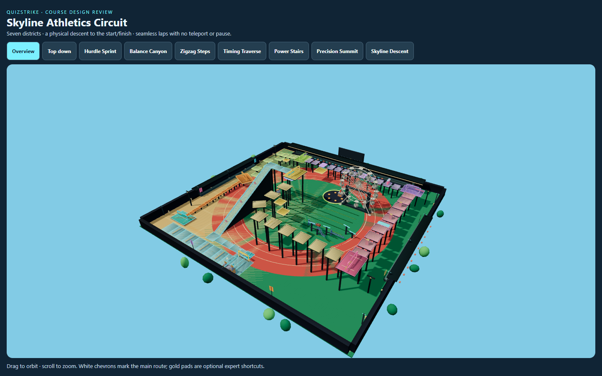
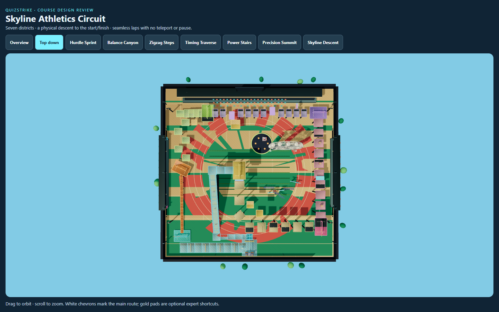
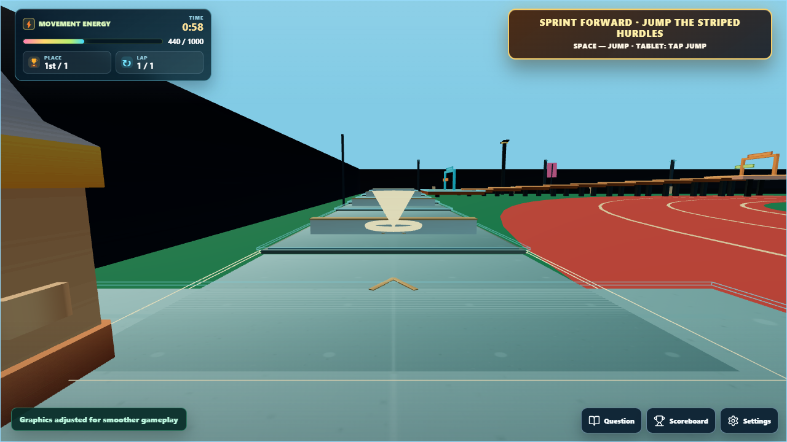
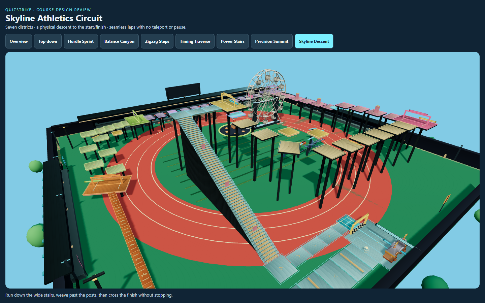
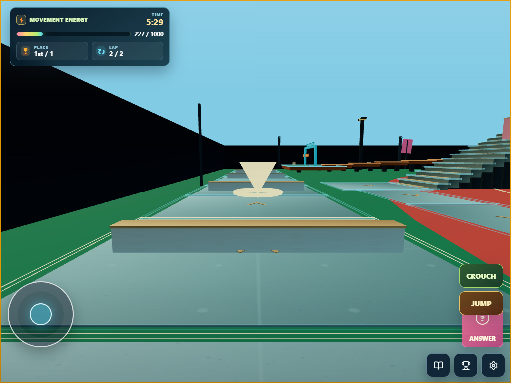

# QuizStrike Athletics circuit redesign

30 September 2026. Audience: upper elementary through high school.

The course has been rebuilt, including its actual walkable geometry, shared
collision, moving obstacles, and navigation. This replaces the previous
stacked attraction route. The review uses code, physics checks, server
integration tests, and desktop/tablet browser captures. A browser-controlled
student session exercises the same joystick, jump, and question controls
available to students; classroom playtesting with students remains separate.

## Route and challenge design

The main course forms a rectangular spiral around the stadium before turning
inward toward the summit. Each zone occupies a separate strip. No two
non-adjacent main-route footprints overlap, except the intentional last-to-first join.
Players see the upcoming challenge rather than another route overhead.

| Zone | Athletic task | Teaching purpose |
| --- | --- | --- |
| 1. Hurdle Sprint | Connected broad runway with four solid low hurdles | Practise movement and jump timing before exposed gaps |
| 2. Balance Canyon | Connected four-unit-wide wooden beams with gentle rises | Practise steering and controlled movement |
| 3. Zigzag Steps | Alternating stepping stones followed by a short stair run | Combine directional jumps and a brief running recovery |
| 4. Timing Traverse | Two necessary moving shuttles and a sliding gate | Board, ride, jump off, and judge a moving opening |
| 5. Power Stairs | Broad ascending terraces, three solid slalom posts, and a lift | Combine climbing with steering around obstacles |
| 6. Precision Summit | Longer exposed jumps, a bend, and the final lift | Apply the learned skills at the summit lookout |
| 7. Skyline Descent | Wide connected descending stairs, three slalom obstacles, and a level return lane | Control speed and steering before crossing into the next lap |

The opening is deliberately connected: difficulty comes from hurdles, not
invisible gaps. Balance beams introduce exposure before precision jumping.
Large checkpoint landings provide breaks between tasks. Three gold branches
remain optional: stair corner cut, expert shuttle bypass, and summit corner
cut. They rejoin the main course without skipping a checkpoint.

| Geometry | Redesigned course |
| --- | --- |
| Main landings / transitions | 138 / 138, including the closing join |
| Horizontal route length | Approximately 1,140 units |
| Height | 0 to 46 units |
| Checkpoints / optional branches | 7 / 3 |
| Authored jump transitions | 32, each with a positive air gap |
| Other transitions | 106 connected, checkpoint, or lift transitions |
| Moving interactions | 2 shuttles, 1 sliding gate, 2 vertical lifts |
| Solid athletic obstacles | 4 hurdles and 6 slalom posts |
| Balance beam width | 4 units |
| Median jump air gap | 4 units |
| Largest shortcut gap | Approximately 10.30 units |

The two twenty-unit shuttle gaps require an intermediate moving deck. They
are not treated as single jumps: both boarding and exit jumps are validated
at each shuttle's minimum, centre, and maximum position. The cyan guide
points to that deck before boarding and to the exit after boarding. Lift
boarding and exit heights use the same slab top as server collision.

## Readability and scenery

- Bright district tops and edges, named zone signs, and cream exit chevrons
  support recognition without relying solely on the floating arrow.
- The guide follows physical support and actual adjacent transitions, holds
  its target during a jump, and follows an optional branch once selected.
- Raised landings have structural supports, including Low quality.
- The Ferris wheel and coaster now occupy the central infield. Their
  imported models and procedural fallbacks both use the new positions.
- Perimeter rails, stands, and trees have moved away from the new lanes.
- The obsolete Drop Tower structure has been removed from the route.
- The lobby introduces the seven tasks before the host starts the race.
- Touch steering uses the joystick's actual vector and strength, allowing
  controlled movement on beams and landings. Connected stair risers step
  automatically; real jump gaps and tall obstacles still require jumps.
- Grounded jump presses survive a slow render frame. Stationary Athletics
  positions are confirmed every 750 ms so authoritative landings and fall
  recovery can settle after movement clamping.

Existing local GLB assets are reused. This redesign adds no external asset
downloads or new licensing requirements. The new athletic obstacles are
procedural and have matching collision in the client and server.

## Continuous laps

The summit is checkpoint six. Players turn onto a physical connector,
descend 64 broad stair treads, steer past three obstacles, and turn onto a
level return lane. Checkpoint seven marks the end of that lane. Its last
landing touches the original start runway, with a checkered start/finish
stripe and a “KEEP RUNNING” sign.

After validating all seven checkpoints, the server records a lap when the
player reaches the start runway. If laps remain, it resets only lap progress
and checkpoint bookkeeping. Position, facing, jumping state, movement epoch,
energy, active question, and the overall race timer continue. There is no
teleport, lap countdown, movement lock, or question modal at the crossing.
On the final required lap, the player finishes at this same bottom line.

Refill questions cycle throughout the race, even when a student has answered
every question in a short quiz pool. Connected floor seams remain supported
when the player straddles two panels; outer edges remain real falls.

## Game modes

Classic, Zeus, Hunters & Runners, and Chaos Climb all use the rebuilt course.
The previously implemented mode improvements remain: clearer briefings,
full-radius Zeus warning rings and reaction windows, separate hunter
contribution/results, advance Chaos hazard warnings, and local hazard paths.
Those paths are sampled from the new shared route rather than old map
coordinates. Checkpoint/finish validation and fall recovery remain server
authoritative.

## Review and validation

Geometry tests cover non-crossing footprints, standard jump reach, shuttle
boarding/exit at motion extremes, lift access, every main landing and recovery
position, shortcut support, and forty-player start spacing. Movement tests
prove that a hurdle blocks grounded movement and permits a jump, while a
slalom post blocks the centre line but permits passing on either side.

Server integration tests cover recovery, stale movement, checkpoint skip
prevention, repeated refill questions, and independent two- and three-lap races. Browser checks cover
all four mode briefings/rendering and iPad controls. The production build and
unit suites are also checked. Captures show implemented geometry rather
than concept art.

Final validation: 627 automated tests passed (one existing test skipped),
four desktop mode checks and two iPad browser checks passed, and the
production build passed.

Run the development server and open **/athletics-lab** for an orbitable review
of the actual builder, imported scenery, and seven zone cameras. This viewer
is excluded from production. Use a normal Athletics session to play the
course and assess classroom difficulty; timing and enjoyment still need
student playtesting.

The browser-controlled student session completed all seven checkpoints,
crossed the bottom finish, and moved onto the first landing of lap two.
It used the real joystick, jump, question, recovery, and look controls without
injecting coordinates or checkpoint progress. Stage seven added no falls;
the movement epoch and active refill question continued across the lap.
Earlier stages required driver retries and the same account was resumed
during debugging; this is a functional circuit check, not a student timing
or difficulty study. See [the recorded outcome](athletics-continuous-playtest.json).

