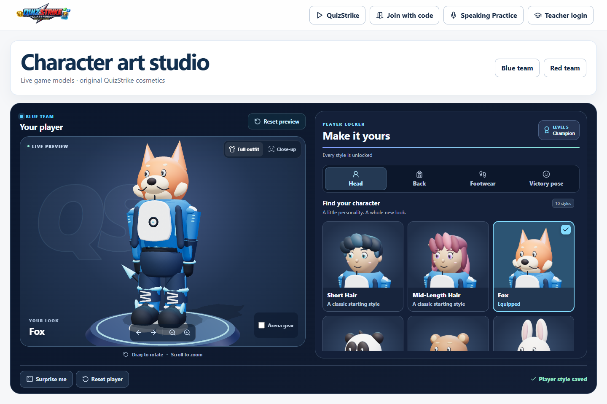

# Character customisation overhaul

Implemented on 4 October 2026. The lobby and arena now use the same original, illustrated QuizStrike characters. Every existing cosmetic has been revised, and all catalogue portraits are rendered from the actual game models.

| Category | Revised styles | Changes |
| --- | ---: | --- |
| Heads | 10 | Smooth face silhouettes, sculpted hair, layered eyes and catchlights, brows, smiles, mascot markings and helmet details |
| Back accessories | 10 | Rounded fittings, stitched packs, sculpted feathers, articulated wings and tails, pleated cape, wrapped sword grips, boost reactors, snowboard graphics |
| Footwear | 6 | Rounded soles, laces, heel loops, tread, sandal buckles and individual toes |
| Victory poses | 4 | Distinct champion, wave, salute and power celebrations; replay without weapon grip constraints |

The shared student body has smoother shoulders, elbows and knees, stitched uniform details, piping, zipper and shoe geometry. Materials retain Three.js skinning, lighting and shadows while adding illustrated contrast, soft rim light and subtle cloth texture. The studio uses environment lighting, warm key light, cool fill and rim light, tone mapping, and a shadowed presentation platform.

## Reference study

The original art direction combines expressive, readable characters with a wardrobe that puts the equipped outfit in focus. These official references informed the direction and interactions:

- [Splatoon 3 gear](https://splatoon.nintendo.com/en/news/beginner-basics-for-splatoon-3-choosing-the-right-gear/) and [weapons](https://splatoon.nintendo.com/en/weapons/).
- [Fortnite locker changes](https://www.fortnite.com/news/new-and-upcoming-fortnite-shop-and-locker-changes?lang=en-US) and [personal banners](https://www.fortnite.com/news/show-off-your-style-banners?lang=en-US).
- [Fall Guys Survival update](https://www.fallguys.com/news/fall-guys-survival-update?lang=en-US).

All revised character and cosmetic meshes, graphic details, and catalogue portraits are authored for this project. Existing community weapon assets retain their existing provenance. The new default student is code-sculpted geometry; this change does not introduce an externally authored character GLB.

## Wardrobe experience

- Large portraits with readable names, equipped indicators and full descriptions.
- Four persistent category tabs, with arrow, Home and End keyboard navigation.
- One persistent WebGL context per team, including when selecting or previewing drawing badges. Selections swap the model while preserving camera rotation and zoom.
- Full outfit, face close-up, rear accessory and footwear inspection. Drag, pinch, wheel, or keyboard buttons control the camera. Arena gear can be shown separately.
- Five quick outfit combinations, respecting existing style unlocks.
- When teachers enable uploads, students can draw badges, add star/bolt stamps, undo, erase, import artwork or camera images, and adjust brightness, size, background removal and outline. Preview is local; Use badge uploads the processed image and saves its asset ID through the existing API.
- The existing save debounce, cooldown retry, teacher policy, progression, compact multiplayer appearance IDs and athletics restrictions remain in effect.
- Reduced motion stops continuous idle rendering and presents a settled celebration pose. A WebGL failure leaves the wardrobe choices available.
- Desktop and tablet use an internally scrolling catalogue. Phones use a single column with normal page scrolling.

## Review and regenerate

Run `npm run dev -w @quizstrike/web`, then open:

```text
http://localhost:5173/character-lab?wardrobe=1
```

This is a development-only review route. The normal student waiting room uses the same wardrobe.

To regenerate all 30 transparent 512 × 512 catalogue portraits:

```sh
node scripts/assets/render-customization-catalog.mjs http://127.0.0.1:5173
```

An optional third argument filters categories, for example `back,footwear,victory`. The script fails on page or shader errors. Source models live in `apps/web/src/game/characters/`; the studio renderer is `apps/web/src/ui/CharacterPreviewScene.ts`.

The older imported student body can be compared explicitly with `?legacyCharacterBody=1`. It no longer replaces the illustrated student asynchronously.

## Verification

- Production build, web TypeScript checks (including E2E types), and ESLint for all touched TypeScript files passed.
- All 320 web unit tests passed. Validation covers character rigs, head bounds, footwear, accessories, animation, weapon grip, verticality, sharing, performance and Japanese translations. Three new regression tests cover visible sword previews, repeated distinct unarmed victory poses, and artwork clearing the chest surface with normal depth testing. The final badge shadow/material adjustments also passed all 15 focused wardrobe, animator and factory performance checks.
- Six Chromium browser tests passed for desktop/tablet/phone scrolling, all 30 portraits, persistent canvas, keyboard navigation, server appearance saving, badge preview/upload/saving, and athletics/teacher restrictions. Badge persistence was tested again after making local badge preview reuse the same canvas.
- Visual review: 1440 × 900, 1440 × 650, 1024 × 768, 390 × 844; no horizontal overflow and no page/shader errors.
- The 40-player high-quality arena smoke check completed with no page/shader errors or WebGL context loss. After a 12-second warm-up, headless Chrome using the local Intel UHD adapter reported 30 FPS and a 37.1 ms p95 frame time in this view. This single sample is not a Chromebook performance certification. Higher geometry detail increases the rendering cost; existing quality controls and animation LOD remain available.

Evidence: [browser report](after/browser-report.json), [arena smoke](after/arena-smoke.json), [full catalogue](after/catalog-contact.png), [desktop lobby](after/lobby-desktop.png), [short laptop viewport](after/lobby-laptop.png), [tablet](after/lobby-tablet.png), [phone](after/lobby-phone.png), [worn drawing badge](after/badge-saved.png).


