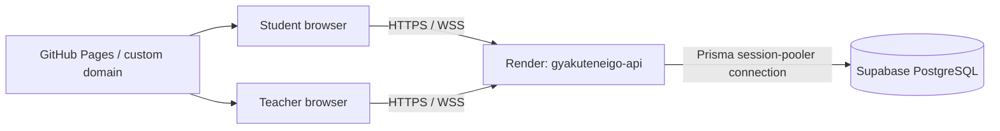

# Online play and deployment runbook

Last verified: 11 August 2026

This runbook covers the current hosted QuizStrike system: a static React/Vite
client on GitHub Pages, one Render Node/Express/Socket.IO service, and a
server-only Prisma connection to Supabase PostgreSQL. It also defines the
single-room authority, reconnect, teacher-pause, and teacher-only Learning
Pulse behavior that must remain true during deployment.

## Production topology



| Component | Production value |
| --- | --- |
| Web artifact | `apps/web/dist` |
| Static host | GitHub Pages, optionally `www.gyakuteneigo.com` and aliases |
| API/Socket.IO | `https://api.gyakuteneigo.com` |
| Render fallback | `https://gyakuteneigo-api.onrender.com` |
| Render service | `gyakuteneigo-api`, one Node instance |
| Database | Supabase project `Quiz Strike Production`, Sydney (`ap-southeast-2`) |
| Database access | Private PostgreSQL session pooler through Prisma |
| Live state | Process-local authoritative room runtime |

The old Render PostgreSQL database is retired and must not be used. Supabase is
not used as a browser database, auth provider, realtime transport, or object
store. The browser communicates with the Render API only.

## Release prerequisites

- Use Node 20.19+ or 22.13+; CI and GitHub Pages use Node 22.
- Confirm the intended `main` commit is deployed.
- Confirm `DATABASE_URL` and `JWT_SECRET` are set only in Render/server
  configuration.
- Confirm `CLIENT_ORIGIN` includes every real web origin that will open the
  game, including custom-domain aliases used by the class.
- Keep exactly one Render instance and preserve room affinity.
- Treat server and browser protocol changes as one compatible release; deploy
  the compatibility server before the matching browser when contracts change.
- Have a recent database backup before schema or persistence changes.

## Build and start

Build from the repository root:

```powershell
npm ci
npm run build -w @quizstrike/shared
npm run build -w @quizstrike/server
npm run build -w @quizstrike/web
```

Render starts the API with:

```text
npm start -w @quizstrike/server
```

For local testing, run `npm run dev` from the repository root. It starts the
Vite client on `http://localhost:5173` and the API on
`http://localhost:4000`. Without `DATABASE_URL`, the API intentionally uses
in-memory storage; this is suitable for UI and classroom-flow testing, but
users, rooms, answers, and reports disappear when the process restarts.

When `DATABASE_URL` is present, `apps/server/src/start.ts` runs
`prisma migrate deploy` before importing the server runtime. If migration
application fails, the process exits and the deployment must be treated as
failed.

Do not use `prisma db push` or `prisma migrate dev` against production.

## Render environment

Set these server-only values in Render:

```text
NODE_ENV=production
NODE_VERSION=22
PORT=4000
JWT_SECRET=<long random secret>
DATABASE_URL=<Supabase session-pooler URL>
CLIENT_ORIGIN=https://gyakuteneigo.com,https://www.gyakuteneigo.com,https://susume.github.io
TRUST_PROXY=true
RUNTIME_STORE=in-memory
```

Optional operational values include `INSTANCE_ID`, `NETWORK_DEBUG`,
`NETWORK_REPORT_INTERVAL_MS`, `ROOM_LEASE_MS`, `ROOM_LEASE_RENEW_MS`, and
`SHUTDOWN_TIMEOUT_MS`. Leave `NETWORK_DEBUG` off unless actively diagnosing a
network issue.

Use the Supabase session pooler on port 5432 for the long-running Node
process. Never print the full URL in logs or paste it into a client build.

## Web build and GitHub Pages

Set these as GitHub Actions variables or equivalent static-host build values:

```text
VITE_API_URL=https://api.gyakuteneigo.com
VITE_API_FALLBACK_URL=https://gyakuteneigo-api.onrender.com
VITE_BASE_PATH=/
PAGE_CUSTOM_DOMAIN=www.gyakuteneigo.com
```

`.github/workflows/deploy-web.yml` runs on `main` pushes or manual dispatch and:

1. installs dependencies with `npm ci`;
2. builds `@quizstrike/shared` and `@quizstrike/web`;
3. injects the public `VITE_*` values;
4. copies `index.html` to `404.html` and creates fallback entry points for
   `/quiz-strike`, `/join`, and `/game`;
5. writes `CNAME` when `PAGE_CUSTOM_DOMAIN` is present;
6. uploads and deploys `apps/web/dist` through GitHub Pages.

After a Pages deployment, open each of these paths directly in a fresh browser
tab, not only through the home page:

- `/`;
- `/quiz-strike`;
- `/join`;
- `/game`;
- `/tournament-study/<released-id>` when applicable.

If the site is hosted below a repository path, set `VITE_BASE_PATH` to that
path and make sure the SPA fallback copies still resolve there.

## Database migrations and RLS

The application uses Prisma migrations in `prisma/migrations/`. The current
schema includes teacher/library data, question audio, sessions, players,
answers, round logs, reports, `RuntimeSnapshot`, Competition, and Tournament
Center models.

The migration
`20260805000000_harden_public_tables_rls` enables RLS on application tables
that exist and revokes `anon`/`authenticated` table privileges when those
Supabase roles exist. It is compatible with the local PostgreSQL setup because
it checks for table/role existence. The intended access path remains the
protected Prisma connection from Render.

After a migration deploy, verify:

1. Render logs show the migration completed before the server listened;
2. `/api/health` reports the expected PostgreSQL storage;
3. teacher login, quiz-library reads/writes, room creation, student join, and
   report creation work;
4. the Supabase project has no unintended public table access or advisor
   warning for the application tables;
5. `RuntimeSnapshot` and normalized rows remain consistent for any migration
   that changes persistence or backfill behavior.

Use `npx prisma validate` for schema validation. Use `npx prisma migrate deploy`
only through the controlled server startup/release path for production.

## Classroom smoke test

Run this after a web/API release and after changes to the arena, protocol,
authentication, live-room controls, or persistence:

1. Sign in as a teacher at `/quiz-strike` and open the Library.
2. Select a quiz and create a room. Exercise the current setup stages: game
   mode, arena/rules, and advanced settings.
3. Confirm the waiting room has a join URL, QR code, roster, bot controls,
   appearance controls, and a visible Start Game action.
4. Join with two learner browsers. Confirm the Socket.IO handshake, room
   snapshot, question assignment, answer result, money, scoreboard, and event
   feed.
5. Start a Flag game and verify Red flag pickup/placement, Blue capture,
   server countdown/result, and carrier disconnect drop.
6. Run a short Zombie game and verify the selection phase, energy, human-to-
   zombie conversion, and end condition.
7. Run a short Classic Tag game and verify team tags, respawns, and round
   resolution.
8. Exercise the shop with Quick/Heavy launcher and a perk; verify the server
   balance, snowballs, cooldowns, and independent weapon/perk slots.
9. Reload or disconnect one learner, rejoin with the stored token, and confirm
   the authoritative snapshot restores the room state.
10. Press Pause Game as the owning teacher. Confirm students see the attention
    overlay, countdowns and BGM stop, movement/firing/answers/purchases are
    blocked, and the pause remains after a student reconnects.
11. Press Resume Game. Confirm the same round resumes with its deadlines
    shifted by the pause duration and student actions work again.
12. Confirm the teacher sees Learning Pulse accuracy and answer totals while a
    student snapshot and public `player_state` contain no Learning Pulse.
13. Open teacher Spectator View, choose a connected learner, and use
    Previous/Next. Confirm it is read-only and does not emit gameplay commands.
14. End the game, open the learning report, export it, and confirm history
    deletion remains teacher-scoped.

Repeat at least one test on the target classroom network. Confirm HTTPS,
WebSocket upgrade, reconnect behavior, and the deployed custom-domain origin.

## Health and deployment verification

```powershell
Invoke-RestMethod https://api.gyakuteneigo.com/api/health
```

Require `ok: true` and the expected `storage: postgres` result. Inspect Render
logs for:

- successful migration application / no pending migrations;
- normalized state restore counts;
- no CORS/origin mismatch;
- no repeated Socket.IO disconnect or room-affinity errors;
- the service reporting ready/listening.

Do not log or expose JWTs, player tokens, passwords, `DATABASE_URL`, private
decal bytes, or raw answer correctness to student clients.

## Reconnect and failure behavior

The browser connects to Socket.IO, sends `client_hello`, receives
`server_hello`, then sends `join_session_room` with either the teacher JWT or a
scoped player token. Reconnect repeats this sequence and receives a complete,
role-scoped `session_state` snapshot. Student sockets join the public gameplay
room; teacher sockets join the teacher-only room. Teacher snapshots include
the derived Learning Pulse, while student snapshots do not.

The room owner alone evaluates bot ticks, deadlines, round conclusions, and
live mutations. Disconnect grace protects temporary network loss; a carrier
drops the Flag objective immediately. Process restart does not provide a
zero-downtime match handoff for sockets, bot memory, rate limits, or decals.

Teacher pause is a control state separate from the round-result `status`. The
owner-only pause/resume HTTP actions freeze gameplay commands and bot/deadline
progress, then shift room-owned absolute timers on resume. The state is
included in reconnect snapshots and checkpoint fields; the Learning Pulse is
recomputed from authoritative answer logs instead of being stored in a
snapshot.

The API client can try the configured fallback API origin for HTTP/API wake-up,
but fallback selection does not make live room state multi-instance-safe.

## Scaling limit

Do not add Render replicas. The following are currently in-memory:

- room state and join-code directory;
- room leases and fencing tokens;
- Socket.IO bindings and room broadcasts;
- bot state, timers, and disconnect grace;
- answer/fire/request rate limits and dedupe caches;
- ephemeral character/decal bytes.

Before horizontal scaling, implement and test a shared room store, distributed
ownership/takeover, Socket.IO adapter/fan-out, owner-aware reconnect routing,
distributed rate limits/deduplication, and object-backed decal storage. The
server intentionally fails closed if `RUNTIME_STORE` is set to an unsupported
value such as `redis`.

## Rollback guidance

For a web-only regression, redeploy the previous Pages artifact/commit while
leaving the API unchanged. For an API regression:

1. stop inviting new rooms;
2. identify whether the change is web-only, server-only, or a database
   migration/protocol change;
3. roll back the API and web to a compatible commit together when protocol or
   shared types changed;
4. do not reverse a production migration by hand;
5. restore from the approved database backup only through an explicit recovery
   procedure;
6. verify health, teacher login, student join, a short game, and report writes.

The application has a temporary protocol-v0 compatibility adapter, but it is a
rollout aid, not a general rollback strategy. Deploy a compatible server before
the matching v1 browser when changing protocol contracts.

## Release checklist

- [ ] Run `npm run lint`.
- [ ] Run `npm run typecheck`.
- [ ] Run `npm test`.
- [ ] Run `npm run build`.
- [ ] Run `npm run test:load` for live transport/server changes.
- [ ] Run `npm run test:e2e` for classroom-flow changes.
- [ ] Run `npx prisma validate` and review migration order for schema changes.
- [ ] Confirm one Render instance, sticky room affinity, and correct origins.
- [ ] Confirm server secrets are not in `VITE_*` or committed files.
- [ ] Deploy API/migrations and inspect logs.
- [ ] Deploy Pages and verify direct SPA routes.
- [ ] Run the classroom smoke test, including at least one current mode and
      one reconnect.

For the authority model and code ownership, read
[`../architecture.md`](../architecture.md). For current development status and
next work, read [`../HANDOFF.md`](../HANDOFF.md).
