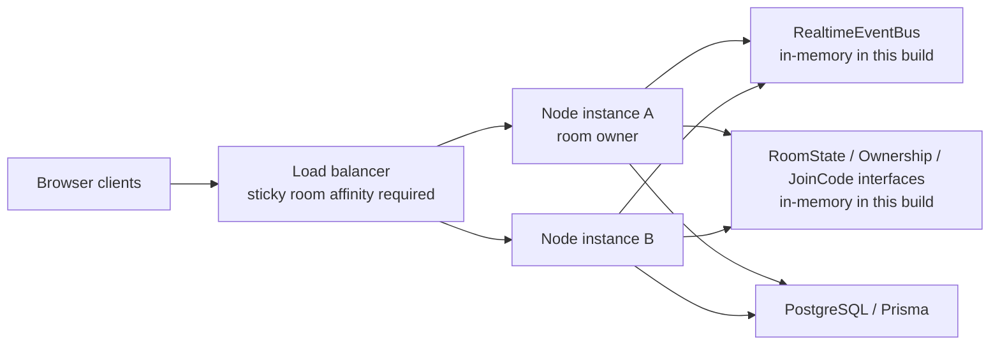

# QuizStrike phases 7-10 architecture

## Starting-state audit

The Phase 1-6 gameplay work was present and covered by tests: local/remote
locomotion, flag planting and deadline state, freeze-streak milestones, bounded
announcement playback, reconnect snapshots, report deletion/retention/naming,
folder moves, quiz deletion guards, and ownership checks. `App.tsx` and
`index.ts` had already become stable feature/bootstrap shims.

The earlier work was incomplete structurally. The implementation still used an
unversioned string-event protocol, parsed Socket.IO payloads inside a 3,700-line
runtime, kept durable teacher fields in `RuntimeSnapshot`, omitted normalized
question update/delete writes, did not restore normalized teacher rows without
the snapshot, and had no runtime-store, event-bus, ownership, or join-directory
boundary. `QuizStrikeApp.tsx` remains large, although socket creation/handshake
is now extracted; further UI decomposition is low-risk follow-up work rather
than a prerequisite for the scaling boundary.

## RuntimeSnapshot classification

| Field | Previous storage | Classification | Current authority | Removal dependency |
| --- | --- | --- | --- | --- |
| users | snapshot + `User` | durable | Prisma `User`; legacy fallback read only | verified production backfill |
| classes | snapshot + `Class` | durable | Prisma `Class`; legacy fallback read only | verified production backfill |
| quizSets/questions | snapshot + normalized rows | durable | Prisma rows; legacy fallback read only | verified production backfill |
| folders | snapshot + `Folder` | durable | Prisma `Folder`; legacy fallback read only | verified production backfill |
| reports | old embedded records + `Report` | durable history | Prisma `Report`; old snapshot read only | all old reports reconciled |
| sessions | snapshot + session tables | recoverable session | `RoomStateStore` live state plus checkpoint snapshot | shared checkpoint adapter |
| answers | snapshot + `AnswerLog` | durable history/recovery | normalized writes plus checkpoint compatibility | reconciliation of old answers |
| transforms, sockets, timers, bot memory | process memory | ephemeral | owning process only | never serialize |
| flag/round deadlines | session snapshot | recoverable session | room owner; absolute timestamps | shared checkpoint adapter |
| freeze streaks | session player state | room runtime | room owner | shared checkpoint adapter |

New `RuntimeSnapshot` writes contain only recoverable sessions and answer
compatibility data. Durable teacher-library fields are no longer dual-written.
The backfill supports dry run, stable-ID upserts, malformed-record counts,
duplicate counts, configurable batch-size reporting, ownership checks, and safe
reruns. The legacy snapshot is deliberately preserved until production count
reconciliation is complete.

## Process-local state inventory

| State | Owner | Lifetime | Serializable | Class | Scaling treatment |
| --- | --- | --- | --- | --- | --- |
| Socket objects/bindings | Socket.IO connection | connection | no | connection-local | stay on connection instance |
| player socket ID sets | runtime connection registry | connection/player | no | connection-local | sticky room affinity today |
| room/session state | `RoomStateStore<GameSession>` | match | yes, excluding resources | room runtime | in-memory adapter; shared adapter deferred |
| join codes | `JoinCodeDirectory` | match | yes | coordination | in-memory adapter; sticky routing required |
| room leases/fencing tokens | `RoomOwnershipStore` | renewable lease | yes | coordination | explicit in-memory ownership |
| flag/round deadlines | `GameSession` absolute timestamps | round | yes | room runtime | only owner evaluates; reconstruct from timestamps |
| bot memory/positions | bot service maps | round | partly | room runtime/ephemeral | owner only; checkpointing deferred |
| disconnect grace timers | connection lifecycle | grace window | deadline only | connection-local | timer local; cross-instance reconnect deferred |
| event IDs | bounded caches | minutes | yes | deduplication | bounded TTL consumer caches |
| announcement/event publication | `RealtimeEventBus` | event | yes | cross-instance messaging | in-memory adapter; Redis deferred |
| persistence/broadcast queues | runtime scheduler | milliseconds | no | process-local | bounded/coalesced and drained |
| rate limits/fire request IDs | security maps | seconds | yes | connection/room local | sticky routing; shared limiter deferred |
| decals | `DecalStore` | session/expiry | no raw socket | room runtime | owner/local memory |
| Prisma teacher/report data | PostgreSQL | durable | yes | durable | normalized repositories |

## Scaling topology and consistency

High-frequency authoritative transforms remain local and are never written per
frame to PostgreSQL or a remote store. Recoverable state uses absolute
deadlines, not serialized timeout handles. The room owner is the only process
that runs simulation/timer conclusions. Leases use fencing tokens; loss pauses
authoritative bot processing. One-time events are at-least-once-safe through
stable IDs and bounded consumers. Match reports additionally use a database
unique constraint.

The current adapters do **not** provide true multi-instance operation. With
`RUNTIME_STORE=in-memory`, all sockets for a room must reach the same instance.
Cross-instance reconnect, command forwarding, pub/sub broadcast, lease takeover
from a crashed process, and shared join-code lookup require Redis-compatible
adapters and integration tests. `RUNTIME_STORE=redis` fails startup explicitly
instead of silently running split-brain.

## Persistence integrity

- Report retention takes a PostgreSQL transaction-scoped advisory lock keyed by
  teacher, then sorts by `createdAt` and stable `id` under serializable isolation.
- Reports retain immutable `quizSetName` and `detailJson`; quiz deletion sets the
  optional relation to null.
- Sessions retain `quizSetName`; question answers retain prompt and correct-choice
  snapshots. Authoring deletion uses `SET NULL`, not cascading history loss.
- Folder routes reject self-parenting, descendants, cross-teacher parents,
  occupied deletion, and cross-teacher quiz moves. PostgreSQL additionally has
  a self-parent check, root-aware sibling-name index, same-owner/cycle trigger,
  and restrictive parent deletion.
- Ownership-sensitive repository methods include the teacher ID in their query
  or validate the parent relation in the same transaction.

## Shutdown and failure behavior

SIGTERM/SIGINT mark the instance draining, reject new matches/connections, stop
owned intervals, cancel connection/broadcast timers, release room leases,
flush the recoverable checkpoint queue, unsubscribe/close the event bus, close
Socket.IO and HTTP, disconnect Prisma, and force exit after a bounded timeout.

If ownership cannot be acquired, room creation fails safely. If renewal is
lost, authoritative bot/timer processing pauses. Event-bus publication failure
is logged and does not expose secrets. Database mirror failures are logged; the
normalized database remains authoritative for durable data. Redis behavior is
not claimed or simulated.

## Configuration

| Variable | Required | Default | Purpose / production implication |
| --- | --- | --- | --- |
| `RUNTIME_STORE` | optional | `in-memory` | Only supported value; Redis fails closed |
| `INSTANCE_ID` | optional | random UUID per start | Stable deployment instance label if supplied |
| `ROOM_LEASE_MS` | optional | `15000` | Ownership lease duration |
| `ROOM_LEASE_RENEW_MS` | optional | `5000` | Renewal period; must be below lease duration |
| `SHUTDOWN_TIMEOUT_MS` | optional | `10000` | Bounded drain timeout |
| `VITE_APP_VERSION` | optional | omitted | Browser build label advertised in hello |
| `DATABASE_URL` | production durable use | none | PostgreSQL connection; no secret is logged |
| `JWT_SECRET` | production | insecure local value | Startup fails in production if unchanged |
| `CLIENT_ORIGIN` | production | permissive local behavior | Allowed browser origins |

## Safe deployment order

1. Back up PostgreSQL and apply the additive history/folder migration.
2. Run `npm run db:backfill -- --dry-run --batch-size=100`; reconcile counts.
3. Run the backfill, rerun it to confirm idempotency, and retain the old snapshot.
4. Deploy the protocol-v1 compatibility server with `RUNTIME_STORE=in-memory`.
5. Deploy the v1 web client and verify hello, join, reconnect, flag, streak, and
   report flows.
6. Configure load-balancer room affinity before adding any second instance.
7. Do not add a second authoritative instance until shared store/pub-sub/lease
   adapters and two-instance tests exist.
8. Remove version-0 protocol acceptance and legacy snapshot reads only after the
   next verified production milestone.

