# GyakutenEigo UI and UX review

Reviewed and implemented locally on September 30, 2026. This review covers the shared hub, QuizStrike, SpeakCheck, and their shared teacher workspace.

## Understanding the system

Before changing the UI, I read `SYSTEM.md`, `architecture.md`, `README.md`, the speaking-practice and teacher-library documentation, and traced the browser router, authentication, teacher dashboard, student join screens, and relevant API handlers. I also captured the existing screens at desktop and mobile sizes.

The repository is a TypeScript monorepo: React 19 and Vite in `apps/web`, Express 5 and Socket.IO in `apps/server`, shared types and validation in `packages/shared`, and Prisma/PostgreSQL persistence for production. QuizStrike is a server-authoritative classroom game with reusable Study Sets, game setup, student entry, live sessions, reports, and competitions. SpeakCheck provides reusable speaking activities, Sets, classroom sessions, AI conversations, and teacher evidence/results. Both use the same teacher account.

| Surface | Entry | Main journey |
| --- | --- | --- |
| GyakutenEigo | `/` | Choose an app, enter a classroom code, or open the teacher workspace |
| QuizStrike | `/quiz-strike` | Host a Study Set or join at `/join`; competitions remain available |
| SpeakCheck | `/speak` | Enter `/speak/join/:code` or open teacher speaking tools |
| Teacher workspace | `/quiz-strike/teacher/*` | Library, Discover, game setup, reports, speaking tasks, competitions, settings |
| Speaking teacher tools | `/quiz-strike/teacher/speaking/*` | Create/save an activity, launch a session, share its code, monitor, review results |

Legacy `/speak/teacher/*` routes normalize into the shared teacher workspace. The changes preserve that routing model, server authority, API contracts, and database schema. The review did not require backend changes.

## Walkthrough and changes

### 1. Choose an app and enter a classroom code — improved

The hub explained the products but made students open an app before locating its join flow. Added a prominent shared code form with native app-selection radios, uppercase/alphanumeric normalization, a six-character validation message, focus recovery, and a clear statement that students need no account. Each selection transfers the code into the corresponding app. Hub copy now explains the teacher workspace and the two activities more directly.

The root page now loads through its own lazy component. The QuizStrike join screen is also lazy. The built hub's module-preload links were inspected: opening `/` does not preload QuizStrike gameplay, Socket.IO, or Three.js.

Checked both app selections with a sample code, incomplete-code recovery, desktop and mobile menus, navigation, and document width. The final hub had no horizontal overflow at the checked 390px and 1280px widths.

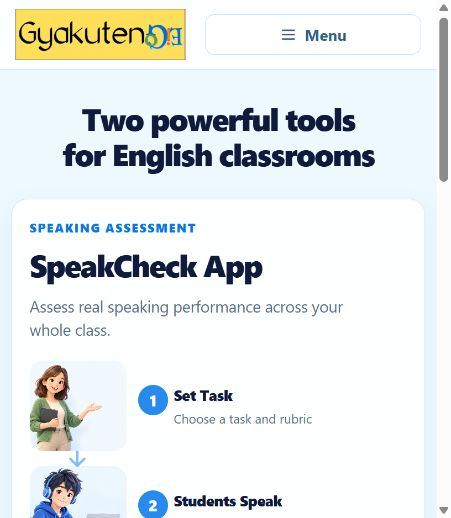

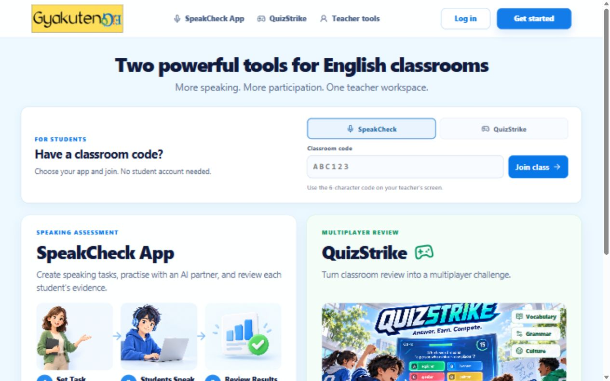

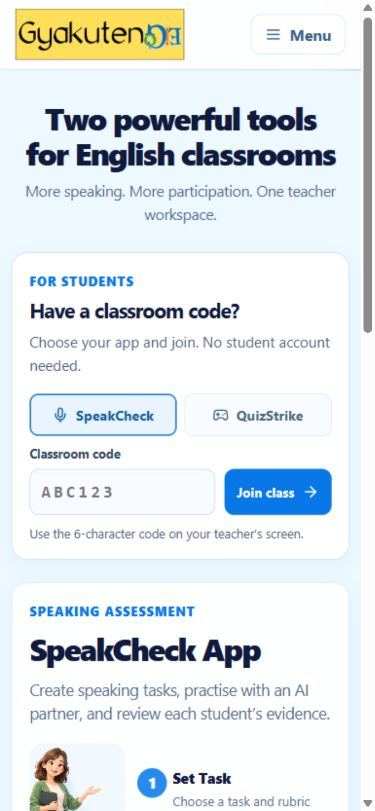

### 2. Find and join a classroom activity — improved

QuizStrike's landing page previously led with competitions, leaving regular classroom hosting and joining inside navigation. Added a classroom launcher with explicit teacher and student actions while keeping the competition content. The host action opens the Study Set library and returns there after authentication.

QuizStrike student entry now has links to QuizStrike and the shared hub, clearer account guidance, and an option to change a code supplied by a link. Its logo now has self-contained responsive sizing; this also prevents horizontal overflow when the isolated join route loads without game styles. SpeakCheck's public code input has a visible label and helper text. Speaking code inputs retain normalized six-character entry.

Checked the code handoff into both join pages, the QuizStrike code-change control, navigation back to the hub, and the signed-out host-to-login-to-library route. A sample code verifies routing and presentation; it is not evidence of joining a real classroom.

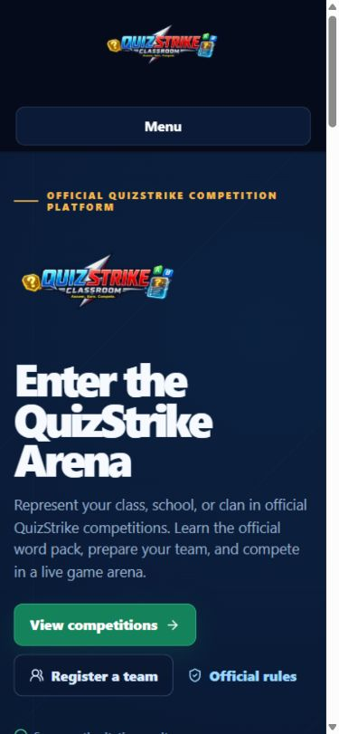

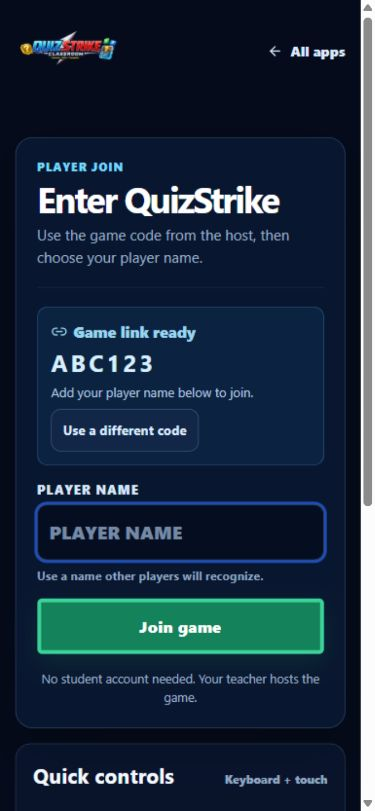

### 3. Move between apps and teacher sections — improved

SpeakCheck navigation changed browser history without consistently informing the outer router. It now emits the routing event for cross-app navigation, so the hub and QuizStrike links actually switch applications. Speaking join pages remount when the route's code changes, preventing stale code state.

The public speaking header now includes QuizStrike, a home action, and a compact mobile menu. The teacher sidebar becomes a labeled Sections menu on smaller screens, exposing all sections without a horizontal navigation strip. It supports expanded-state announcements, Escape to close and restore focus, and focus transfer into content after choosing a section.

Checked the public app-switch links, teacher section switching, the expanded mobile menu, and Escape focus restoration. Checked teacher authentication restoration and signup entry. Signup fields now enforce the same minimum name/password requirements as the server, and switching authentication modes clears stale errors.

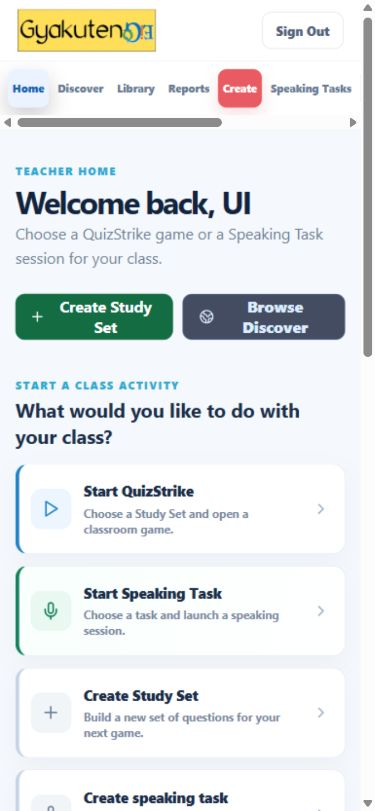

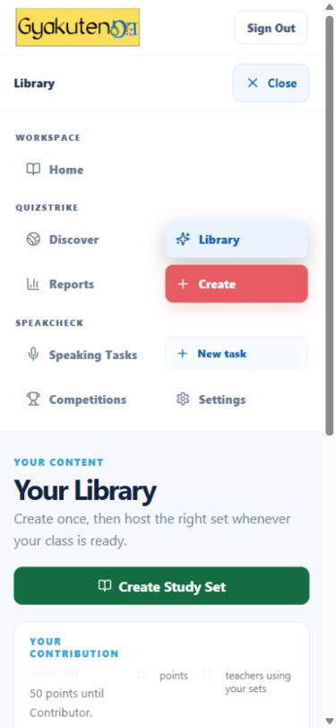

### 4. Find and reuse teacher content — improved

My Library now searches titles, descriptions, subjects, and grade levels, shows a result count, sorts by latest update, and provides a clear no-match recovery action. Empty Study Sets cannot be hosted and explain why through the Host control's hint. Discover copies show inline success feedback and a pending state instead of a blocking browser alert.

Checked with synthetic local data: three Study Sets including an empty draft, a search returning one matching set, a no-match search and recovery, a disabled draft Host action, and a successful public-set copy. Public copy controls stay disabled while copying. Set-card content alignment and recognition text contrast were also corrected.

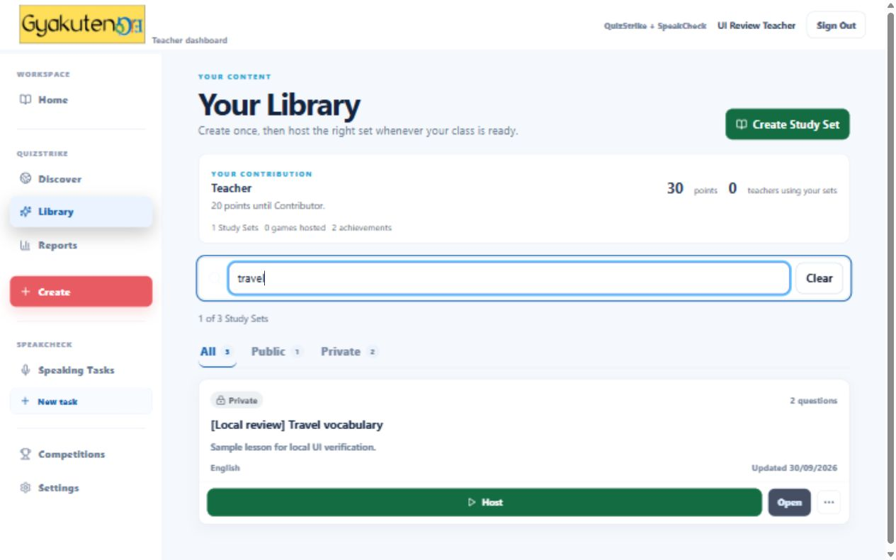

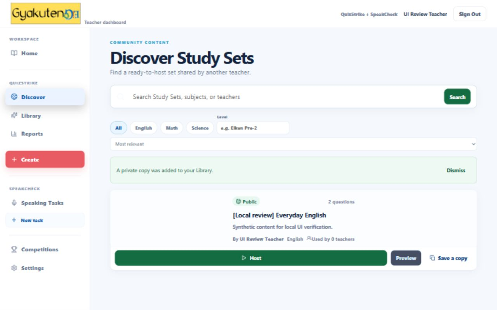

### 5. Prepare and launch SpeakCheck — improved and smoke checked

At tablet width the speaking toolbar squeezed the sort control into a narrow column. The filter layout now uses two columns at intermediate widths and one on narrow phones, with a labeled Clear filters action and larger touch targets. A failed Sets request now offers retry instead of displaying an empty-library invitation.

Checked the rebuilt speaking library at 768px, confirmed every filter is readable and document width matches viewport width, and launched a saved local activity through the actual API. The classroom screen displayed a generated code, QR code, student URL, and live monitor. Physical microphone capture and external AI providers were not exercised.

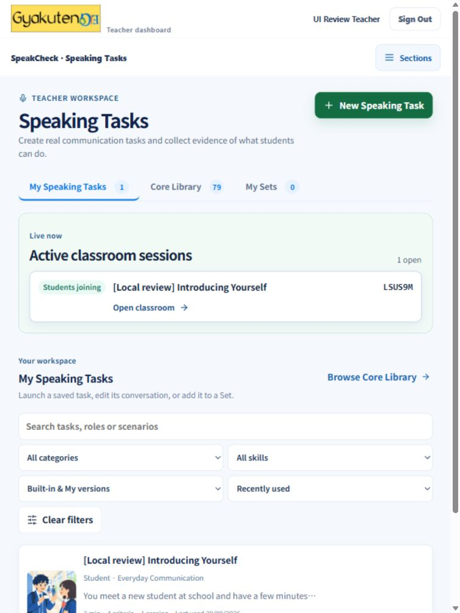

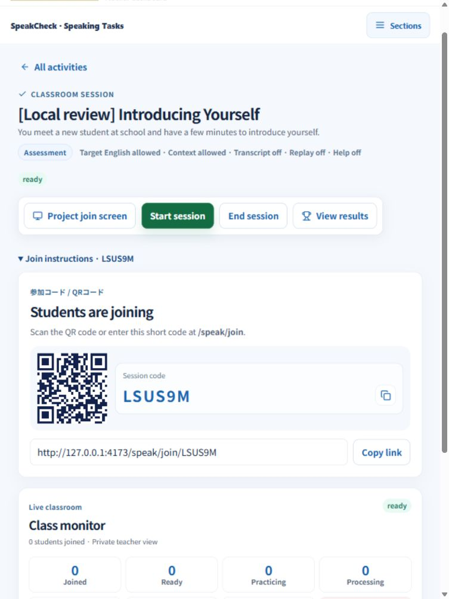

## Loading and reliability work

Teacher Home now distinguishes loading, failed loading, and a genuinely empty workspace. It offers retry on failure, uses accurate active-game status labels, and sorts completed activity newest first. Dashboard requests use a sequence guard so an older request cannot overwrite newer data or update a discarded workspace. Optional recognition data loads independently and cannot delay the classroom dashboard. Teacher session restoration displays an opening state instead of briefly presenting the login form.

These request/error changes were reviewed in code and passed existing automated checks. Failure handling was not exhaustively exercised through injected network failures in the browser.

## Validation

| Check | Result |
| --- | --- |
| `npm test` | 598 passed, 1 skipped: shared 144; server 173 passed/1 skipped; web 274; proxy 7 |
| Web tests repeated after the main implementation | 274 passed |
| `npm run lint` | Passed |
| `npm run typecheck` | Passed, including server, shared, web, e2e TypeScript, and proxy |
| `npm run build` | Passed for all workspaces |
| Final web production rebuild | Passed after the final responsive adjustments |
| `git diff --check` | Passed |
| Browser walkthrough | Built Vite preview with real local API requests and synthetic records; desktop, mobile, and tablet checks |

Browser verification used an in-memory local server and mock speaking providers. Production database persistence, paid/external AI calls, real microphone/audio behavior, multiplayer gameplay, and the full automated browser e2e suite were not verified during this review. The existing Three.js vendor chunk still triggers Vite's size warning, but the public hub does not preload it. No deployment was performed.

Local built preview: `http://127.0.0.1:4173/`, with the local API on port 4000. Synthetic local content can disappear when the development server restarts. Screenshots show local review data, not production records.
