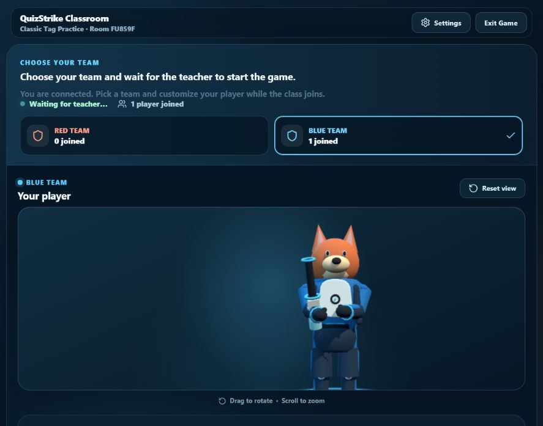
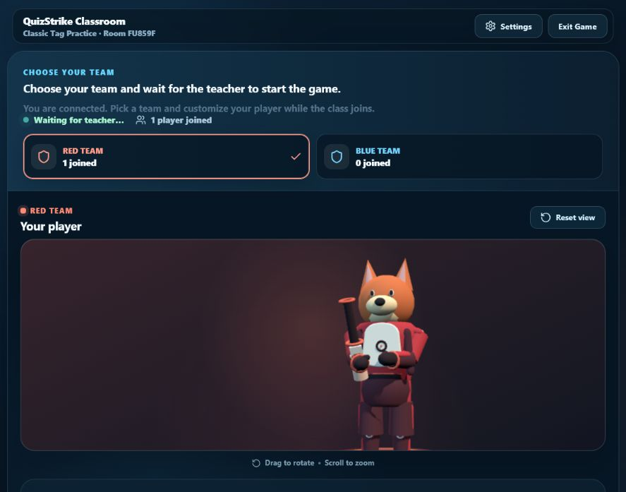
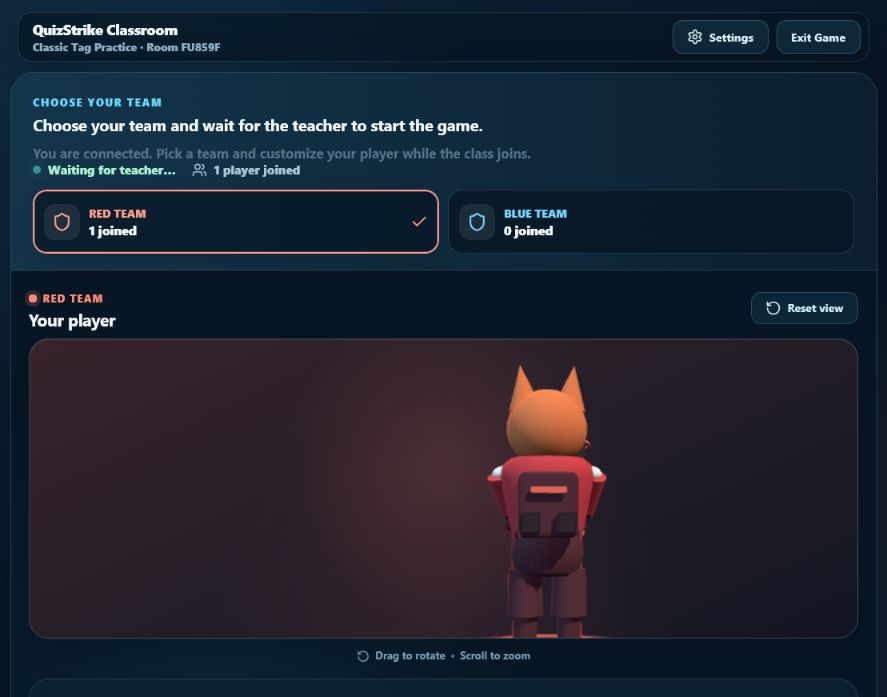
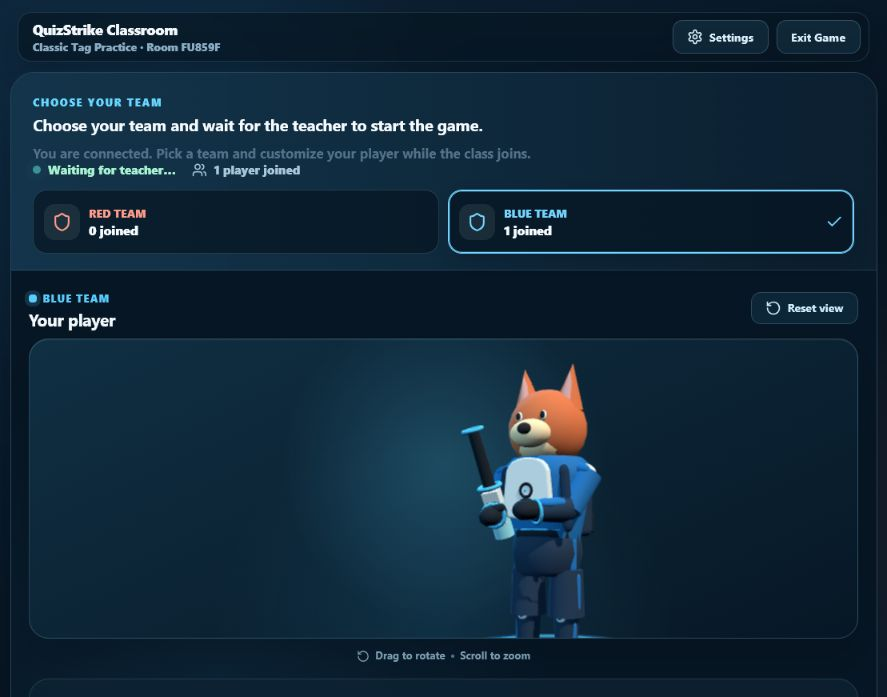
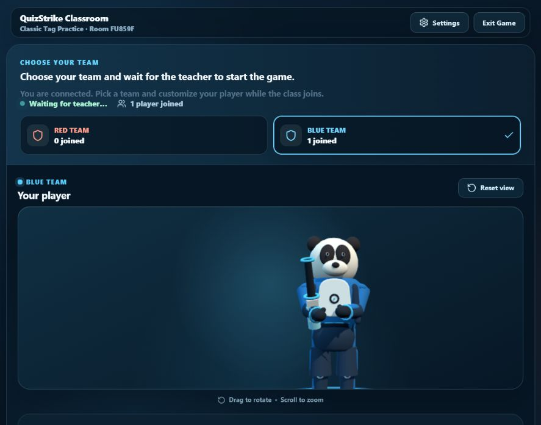
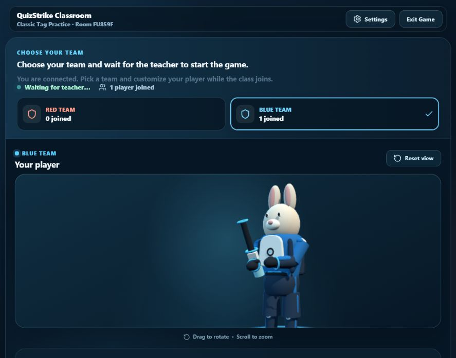
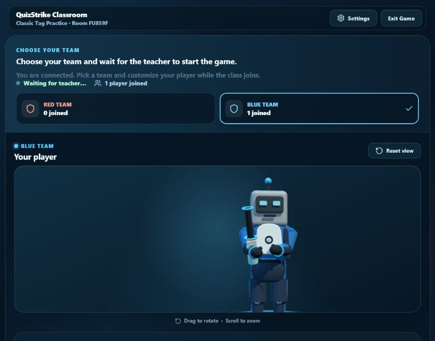
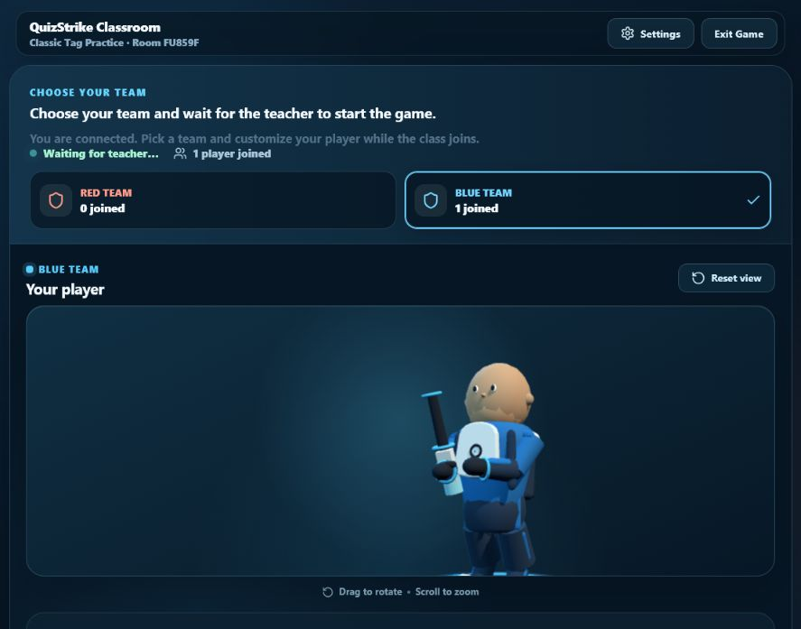
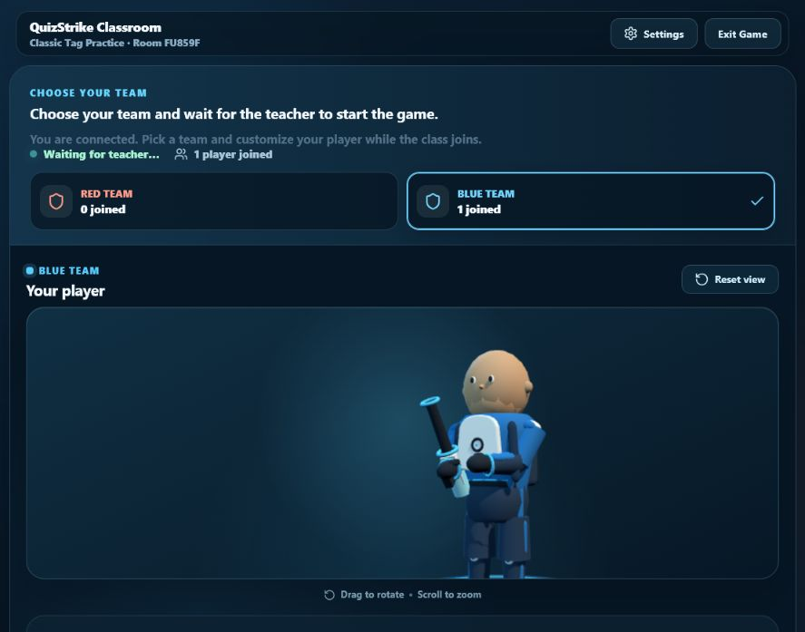
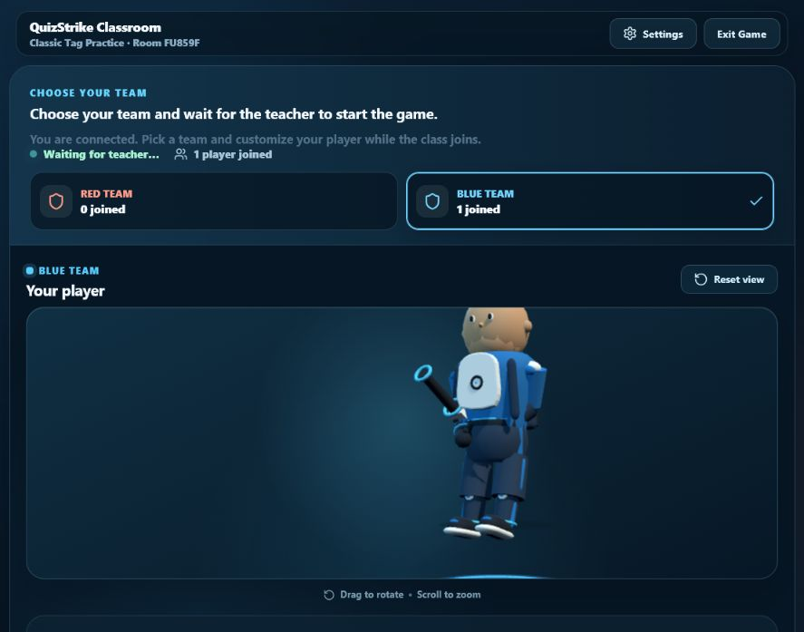

# QuizStrike Body and Team Uniform Redesign

## Outcome

The shared procedural character now reads as one stylized arena athlete. The former spherical white chest, exposed-looking ball joints, skin-dependent hands and neck, blocky waist, tube legs, and undersized footwear have been replaced with one colour-blocked QuizStrike uniform that is shared by both teams.

## Audit

- `SharedSkinnedStudent.ts` builds one merged procedural `THREE.SkinnedMesh`.
- The mesh uses rigid weights on the existing 13-bone hierarchy: root, torso, head, upper arms, forearms, hands, thighs, and shins.
- `CharacterFactory.ts` creates the same model for the lobby preview and remote gameplay characters.
- `CharacterAnimator.ts` reconstructs idle, locomotion, crouch, aim, fire, jump, respawn, knockout, and victory poses locally.
- `CharacterEquipment.ts` parents the blaster to `RightHandWeaponSocket` and exposes `LeftHandSupport` and `MuzzleSocket`.
- `CharacterAccessories.ts` attaches back cosmetics to `BackSocket` on the torso.
- `CharacterHeadStyles.ts` attaches one complete head to the retained `HeadSocket`.
- `CharacterHitboxController.ts` updates fixed gameplay boxes from `CHARACTER_HITBOXES`; visual meshes are not used as hitboxes.

## Why the previous body looked fragmented

The body was technically one mesh, but it visibly presented as separate primitives:

- a large flattened white sphere dominated the chest;
- white spherical shoulders and knees exposed the joint structure;
- upper and lower limbs kept near-uniform cylinder profiles;
- skin-coloured hands and neck assumed a human body;
- the pelvis and waistband read as a separate block;
- the footwear was too small and visually weak;
- Blue and Red had different base silhouette settings despite needing one shared uniform.

## Geometry changes

- Reprofiled the torso into a compact chest-to-waist taper.
- Added dark jersey side insets and a smaller bevelled neutral chest panel.
- Added a subtle centre-chest QuizStrike-style ring emblem.
- Replaced the visible neck with a padded dark collar and team-colour trim.
- Added a torso-weighted shoulder yoke and overlapping flattened shoulder pads.
- Tapered upper arms and forearms and concealed elbow pivots under cloth.
- Replaced skin hands with dark mitten-like gloves, thumbs, and team cuffs.
- Added a rounded waistband, trouser pelvis, and team hip panels.
- Rebuilt legs as continuous athletic trousers with outer team panels.
- Buried knee pivots under dark fabric and added small integrated kneepads.
- Enlarged the trainers with dark uppers, team toe panels, accent cuffs, and thin pale soles.

The skeleton topology, bone indices, rigid weighting strategy, attachment bones, root scale, and animation API remain unchanged.

## Uniform and team colours

Both teams now use the same base silhouette and uniform construction. `TEAM_APPEARANCE` remains the sole palette authority:

- Blue: bright athletic blue, navy cloth, pale neutral panel, cyan trim, near-black navy.
- Red: sport red, burgundy cloth, warm neutral panel, coral trim, near-black burgundy.

Character presets remain available and may apply the existing bounded preset silhouette modifiers. Team membership itself no longer changes the base geometry.

## Attachments

- Head styles were not redesigned. Human, Fox, Panda, Rabbit, and Robot were rendered against the new padded collar without floating gaps or collar-specific clipping.
- The existing weapon mount did not require a transform change. The new glove silhouette improves the two-handed read while preserving the right-hand socket and left support target.
- The existing backpack socket did not require an offset change. Front, side, rear, and rear three-quarter checks confirmed the default utility pack remains centred and close to the upper back.

## Animation and visual QA

Rendered in the live character creator:

- Blue and Red from front, back, left, right, front three-quarter, and rear three-quarter.
- Human, Fox, Panda, Rabbit, and Robot.
- Idle, walk, sprint, crouch, aim, shoot, jump, respawn, and victory.

Automated animation assertions cover knockout, hit, fire, walk, sprint, crouch, aim, jump, respawn, objective carry, turning, and all victory pose variants. No shoulder, elbow, knee, head/collar, backpack, or hand/weapon separation was found in the accepted captures.

## Screenshots

### Team comparison

### Back and three-quarter checks

### Head compatibility

### Pose checks

The full accepted turnaround and pose matrix is stored in `docs/uniform-redesign/after/`.

## Performance and verification

- Per shared body: 7,520 triangles, 13 bones, one skinned mesh, one body material.
- Forty-character construction test: 309 ms in the final full test run.
- Forty characters across both teams: two shared body geometries and two shared body materials.
- Fixed gameplay hitbox constants are unchanged.
- Full workspace production build: passed.
- Full workspace typecheck: passed.
- Explicit-path test run: 206 tests passed.
- Fresh browser load: no console warnings or errors.

The repository's top-level `npm test` command still has its pre-existing Windows quoted-glob problem. The complete suite was run with the same `tsx --test` runner using explicitly discovered test files.

## Remaining limitations

- The body remains procedural rather than an artist-authored GLB.
- Rigid weights favour predictable performance over soft joint deformation.
- The support hand uses the existing tuned pose and named support target rather than runtime IK.
- The procedural Human head remains visually simpler than the animal and Robot heads; head redesign was outside this task.
- Physical Chromebook performance still needs device certification. The delivered checks cover resource sharing, triangle/construction budgets, a 40-player rendered lab run, build, tests, and browser visual QA.
